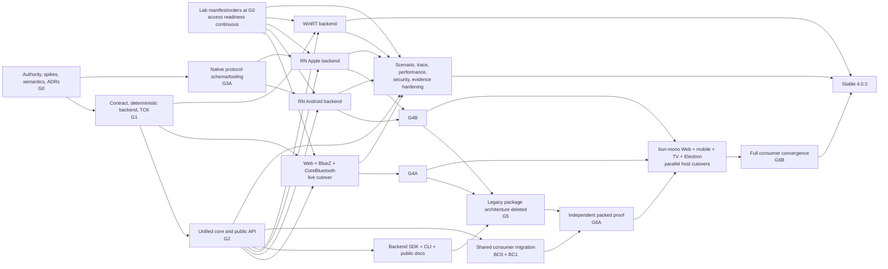

<!-- docs/UNIFIED_BLE_4.0_IMPLEMENTATION_PLAN.md -->

# Unified BLE 4.0.0 — Clean-Baseline Architecture and Implementation Plan

**Status:** Verified implementation-ready plan of record

**Branch:** `4.0`

**Package:** `unified-ble-manager@4.0.0`

**Audience:** users, external backend authors, maintainers, reviewers, CI owners, and platform lab operators

**Last updated:** 2026-07-31

**Related product roadmap:** [`../ROADMAP.4.0.md`](../ROADMAP.4.0.md)

**Related platform backlog:** [`GAPS.4.0.md`](GAPS.4.0.md)

---

## 1. Executive decision

`unified-ble-manager@4.0.0` is a new open-source package with no production users. It is not a compatibility release of `react-native-ble-plx`, even though it inherits proven code and platform work from that project.

This is the one-time opportunity to establish a best-of-breed BLE central foundation that unrelated applications, libraries, device vendors, mobile products, desktop products, web products, XR products, and independently shipped backends can adopt. Track Our Health's `bun-mono` repository is the first proving consumer, not the design authority. The public contract must make sense without any Track Our Health concept.

The long-term ambition is to be a credible modern replacement for Noble in BLE-central/GATT use cases by owning first-party BlueZ, CoreBluetooth, and WinRT backends. That ambition does not silently expand 4.0.0 into Bluetooth Classic or peripheral mode; those require separate contracts and proof.

The implementation must therefore converge on:

1. one versioned backend contract;
2. one shared manager/policy core;
3. one bytes-first data model;
4. one backend feature registry that binds capability claims to typed implementations;
5. one normalized event and error model;
6. one backend conformance kit;
7. one scenario system above the conformance kit;
8. explicit native and desktop serialization protocols;
9. deterministic lifecycle, cancellation, buffer-ownership, and overflow semantics;
10. hard deletion gates for the transitional architecture;
11. a framework-neutral public core with isolated host subpaths;
12. a publishable backend SDK and conformance kit for third parties;
13. one authority for every contract, schema, capability, semantic rule, and generated projection;
14. an open-source release process whose claims are backed by public evidence.

The current `BlePort`, `PortBleManager`, React Native `BleManager`, Base64 bridge, static host capability matrix, numeric native handle registry, and transaction-ID public surface are implementation inputs. They are not constraints on the final 4.0.0 API.

The migration will preserve proven native radio work and test knowledge, not obsolete public or internal shapes.

No product-specific abstraction is allowed into the package merely because the first consumer uses it. In particular, the package must not depend on or expose Track Our Health vendor managers, `DeviceManagerHub`, telemetry types, medical-device concepts, RxJS, Expo application state, or bun-mono reconnect policy.

---

## 2. Document authority and relationship to existing plans

The planning documents have distinct responsibilities:

| Document                                      | Authority                                                                                           |
| --------------------------------------------- | --------------------------------------------------------------------------------------------------- |
| `ROADMAP.4.0.md`                              | Product scope, positioning, platform ambition, and release goals                                    |
| `docs/UNIFIED_BLE_4.0_IMPLEMENTATION_PLAN.md` | Architecture, sequencing, contracts, deletion gates, and engineering acceptance criteria            |
| `docs/GAPS.4.0.md`                            | Platform-specific code, CI, packaging, live-radio, and reliability proof inventory                  |
| `docs/UNIFIED_SEMANTICS.md`                   | Normative runtime behavior once created in Phase 0                                                  |
| Contract ADRs                                 | Frozen decisions for public API, backend contract, capabilities, native protocol, and serialization |

When an older roadmap or gap entry describes the transitional dual-manager, Base64, static-capability, or compatibility architecture, this plan controls the replacement work. The gap tracker continues to control platform proof requirements unless an explicit scope ADR changes them.

No existing “done” status for the transitional `BlePort`, host matrix, RN queue wiring, or Base64 byte façade means that the corresponding clean-baseline work in this plan is complete.

### 2.1 Implementation-first execution law

This plan is executed through working vertical slices, not through a separate
documentation phase:

1. implement the smallest complete dependency-valid vertical slice;
2. run it with focused deterministic tests;
3. treat runtime, compiler, package, or native-build contradictions as the
   authoritative feedback;
4. update the affected type, semantic rule, ADR, and test together;
5. rerun the focused slice;
6. after the dependency gate passes, promote the accepted behavior immediately
   into the production contract, core, TCK, or backend;
7. continue to the next dependency gate.

The first required slice is:

`DeterministicBackend → unified core → scan → connect → discover → read → notify → destroy`

It also proves cancellation, deadlines, overflow, late-event quarantine,
generation invalidation, byte ownership, two-client arbitration, and zero
cleanup counters.

The following rules prevent execution from regressing into overplanning:

- a Phase 0 artifact that passed a zero-actionable-finding review is not reopened
  unless downstream executable evidence concretely contradicts it;
- documents record decisions required by code and gates; document production is
  not progress by itself;
- reviews cover a coherent executable milestone and return findings as one
  batch; fixes run in parallel where independent;
- development uses focused tests; the expensive integrated
  build/package/native suite runs once per coherent milestone;
- hardware acquisition and live evidence continue independently; unavailable
  hardware blocks only the associated evidence label, never deterministic
  contracts, core, TCK, SDK, packaging, or unrelated backends;
- after `G0`, accepted spike behavior moves directly into production contract
  v1/core/TCK work; there is no second documentation-only interval;
- implementation must advance the final clean baseline. Compatibility layers,
  Base64 normal paths, static capability matrices, Noble fallbacks, fake
  production success, placeholders, warning suppression, and reduced scope are
  not acceptable shortcuts.

#### G0 closure and production-promotion rule

`G0` closes after the already-authorized semantic and JSI review batches have
been fixed and one consolidated zero-diagnostic gate passes. That result freezes
the accepted Phase 0 contract declarations, seven ADRs, deterministic executable
model, and JSI binary-boundary proof. They are reopened only when downstream
implementation produces concrete contradictory evidence.

Immediately after that gate, the spike is deleted or reimplemented as production
code. `G1` runs continuously in three independent lanes:

The immutable Phase 0 correction records remain under
[`docs/evidence/g0`](evidence/g0) as historical evidence only. They are not
runtime source, production TypeScript input, package exports, or package
artifacts; G1 absence checks enforce that the draft-contract and core-model
runtime trees contain no files.

1. production contract models, components, and feature declarations under
   `src/backend-contract/**`;
2. `DeterministicTestBackend` and its virtual peripheral;
3. the base TCK plus ownership, lifecycle, and feature suites.

The first production merge unit is an executable vertical slice:

`public manager → unified core → DeterministicTestBackend → scan → connect → discover → read → notify → destroy`

Each lane integrates when its frozen dependencies are available. `G2` work may
start against an accepted production contract/core section without waiting for
unrelated `G1` sections to finish. Apple and Android backend work starts after
the contract surfaces each backend consumes are frozen; missing live hardware
affects only the corresponding evidence label.

SDK, CLI, generated public documentation, and bun-mono consumer migrations
remain required for 4.0, but begin after `G2`; they must not interrupt
contract/core/TCK convergence.

#### Current execution state

`G0` is complete and frozen as of 2026-07-25. Its consolidated gate passed the
semantic and evidence validators, draft-contract compile fixtures, strict
TypeScript and lint checks, the full package test suite, package build and
packed-consumer smoke tests, Android JVM and APK builds, and the iOS simulator
build/install/launch/JSI probe. The JSI evidence receipt is
`893c6dbb9a559c1a84232e98823d295ba0d42e6810a5112669af80c6d0748a75`.

The production contract/core/TCK/public-manager milestone was accepted on
2026-07-26 after its consolidated zero-warning gate passed 60 suites and 940
tests, package build and artifact verification, exact export checks, isolated
canonical-package installation under CJS, ESM, Bundler, Node16, and NodeNext,
and a final cold review returned zero actionable findings. The accepted
production slice covers scan, connect, generation-consistent discovery, read,
write, notification, destroy, cancellation, deadlines, overflow, ownership,
retryable cleanup, late completion, quarantine accounting, and deterministic
resource settlement.

This is a one-way execution boundary, not a claim that 4.0 is nearly complete.
The remaining work is platform backends, package SDK/CLI and documentation
surfaces, consumer migrations, deletion gates, live evidence, and release
qualification. The active engineering default is therefore:

1. do not polish or broadly re-audit frozen `G0` work;
2. reopen only the smallest affected `G0` authority when production code
   supplies a concrete contradiction;
3. spend the large majority of effort on production executable slices;
4. review once per coherent gate, fix the complete finding batch, and run one
   consolidated gate;
5. start dependency-ready `G2` work without waiting for unrelated `G1` work;
6. keep native and hardware evidence off the contract/core/TCK critical path.

The accepted production authorities are `src/backend-contract/**`,
`src/testing/deterministic/**`, `src/tck/**`, `src/core/**`, and
`src/manager/**`. The active implementation lanes now move to dependency-ready
first-party platform backends and their final public/core vertical slices.
Progress is reported by dependency gate achieved and executable behavior added,
not by document count.

The 2026-07-31 platform-hardening milestone closed three contradictions found by
real consumer and backend integration. The Web environment now accepts the
standard DOM `navigator.bluetooth` object directly without a consumer cast or
adapter. Apple Native Protocol v2 now bounds its pre-JavaScript event buffer at
64 records and 256 KiB, discards the entire retained prefix on overflow, and
reports one counter-bearing `stream.overflow` terminal before closing ingress,
so JavaScript cannot claim a partial restoration replay. Attachment generations
quarantine queued callbacks, sink lifetime is serialized with detach/close, and
overflow plus close failure preserves both errors while retaining exact cleanup
retry ownership. WinRT GATT failures now preserve validated HRESULT or
GATT-status data inside normalized serializable platform errors across direct
operations, every public `GattDatabase` read/write path, and retryable CCCD
disable cleanup instead of leaking or flattening raw native errors.

That milestone passed strict lint/typecheck, 76 package suites and 630 tests,
30 plugin tests, native-protocol host tests, Android protocol JVM tests, the iOS
simulator build, evidence validation, and the canonical packed CJS/ESM/Web/CLI/
BlueZ/Electron/third-party-TCK/TypeScript consumer matrix. It advances G3/G4
implementation but does not claim G4A or G4B: Windows native compile/ABI/live
proof, Linux BlueZ live proof, the complete Web live scenario, and the complete
Apple/Android physical-radio and lifecycle evidence remain separate gates.

---

## 3. Goals

### 3.1 Product goals

The final system must support a unified BLE central programming model across:

- React Native Android;
- React Native Apple platforms;
- Android-derived XR environments through the open backend/profile registration model; Meta Quest implementation is explicitly deferred to 4.1;
- macOS Electron/CoreBluetooth;
- Windows Electron/WinRT;
- Linux Electron or Node/BlueZ;
- Web Bluetooth;
- a deterministic virtual test backend;
- future backends registered without editing closed platform unions.

The package must also be usable by:

- a plain TypeScript application with no React dependency;
- a React Native application with or without Expo;
- a Node process with no DOM or React Native globals;
- an Electron main process and a sandboxed renderer proxy;
- a browser application using Web Bluetooth's chooser constraints;
- a third-party backend package built outside this repository;
- a library author who needs stable BLE contracts without adopting any application framework.

### 3.2 Architecture goals

- Backends implement radio and OS integration only.
- The shared core owns cross-platform policy.
- The public API exposes normalized behavior, not lowest-common-denominator mimicry.
- Runtime capability reports reflect the instantiated backend and environment.
- Backend capability registration cannot claim a feature without providing its typed implementation.
- All payloads are `Uint8Array` at the public and backend contracts.
- Cancellation is `AbortSignal` at the public/core boundary and an opaque operation handle at backend or process boundaries.
- Handles have explicit generation and lifetime rules.
- Async streams have explicit overflow behavior.
- State crossing React Native or Electron boundaries is serializable and reconstructible.
- A backend author can implement the contract using the normative documents and TCK without reading existing backend source.

### 3.3 Quality goals

- No duplicated manager policy between React Native and port hosts.
- No duplicated Base64 and byte method families.
- No static host capability matrix.
- No optional backend methods accessed through casts.
- No silent capability degradation.
- No unbounded BLE event buffering.
- No stale-handle behavior left to backend accident.
- No platform marked supported without the required proof level.
- No old and new architecture left alive indefinitely.
- No platform support claim backed only by mocks, compilation, or a deterministic simulator.
- No placeholder backend, method, event, capability, native binding, or release artifact.
- No Track Our Health name, domain type, vendor rule, telemetry concept, or lifecycle policy in public package code.
- No mandatory React, React Native, Expo, Electron, RxJS, Noble, BlueZ, or DOM dependency in the universal root import.
- No handwritten duplicate of a contract projection that can be generated or mechanically verified from its authority.

### 3.4 Ecosystem and maintainability goals

- An external backend author can implement, validate, and publish a backend without reading a first-party backend.
- A user can choose a host backend explicitly and understand its evidence level and limitations before radio work starts.
- Public documentation separates portable semantics from backend-specific limitations.
- The package has no telemetry or network activity by default.
- Diagnostic exports are explicit, local, bounded, redacted by default, and versioned.
- Public APIs follow npm semantic versioning while runtime backend/protocol negotiation allows independently shipped compatible backends.
- First-party backends do not depend on Noble; Noble may be used only as temporary characterization input before its deletion gate.
- The project publishes provenance, artifact contents, support evidence, security policy, contribution rules, and compatibility ranges.

### 3.5 Modernization floor

The 4.0 implementation targets the modern platform line, not legacy architecture compatibility:

- React Native 0.86 or newer on the supported 4.0 range;
- React Native New Architecture/TurboModules only—no legacy bridge fallback;
- Expo SDK 57 or newer on the explicitly tested range, with CNG/config-plugin proof;
- React Native CLI and Expo are separate fixtures; “classic” means non-Expo CLI, not legacy architecture;
- TypeScript declarations use strict modern syntax and are tested against the declared minimum and current compiler;
- ESM is the primary JavaScript distribution; CommonJS remains only where the Node/Electron support ADR explicitly tests it;
- no deprecated React Native, Android, Apple, Node, Electron, Web Bluetooth, D-Bus, N-API, or WinRT API is introduced;
- OS, Node, Electron, browser, Xcode/Swift, JDK/Kotlin, Gradle, N-API, and TypeScript minimums are frozen in the packaging/platform ADR from current official support data and encoded in CI/evidence manifests.

Raising a floor before 4.0.0 is preferable to shipping a compatibility branch. After GA, floor changes follow semantic-versioning and published support policy.

---

## 4. Explicit non-goals and deferred scope

The following are not foundation blockers:

- Bluetooth peripheral mode;
- Bluetooth Classic;
- LE Audio as a 4.0 foundation requirement;
- L2CAP CoC implementation before contract/core/TCK convergence;
- React hooks before the public manager and handle model freeze;
- delivery of a shared controllable physical test peripheral in 4.0; hardware/provider selection, procurement, and implementation are deferred to the 4.1 plan;
- Nitro Modules without satisfying the existing evidence-based escalation gate;
- bit-identical physical device identifiers across operating systems.

These features remain planned after the contract and core can support them cleanly. Deferral does not permit placeholders in production paths.

### 4.1 Explicit 4.0 scope decision

The project deliberately chooses a comprehensive stable `4.0.0`, not a minimum release containing only the contract, deterministic backend, React Native, and one desktop backend. Zero existing consumers makes this the correct time to establish the complete clean baseline rather than publish a partial architecture that immediately needs a second convergence release.

Stable `4.0.0` therefore requires:

- the versioned contract, unified core, public API, deterministic backend, TCK, scenarios, backend SDK, diagnostics, CLI, documentation, evidence, security, packaging, and governance systems in this plan;
- React Native Android and Apple backends;
- Web Bluetooth;
- owned BlueZ, CoreBluetooth, and WinRT desktop backends;
- Electron main/renderer IPC;
- the independent-consumer proof and complete first-consumer convergence gates defined in Phase 6;
- live proof for every environment described as supported.

Maintainer scope decision, 2026-07-25: Meta Quest is deferred to 4.1. It is not a 4.0 work package, evidence requirement, or release blocker. The 4.1 work retains the intended shared-Android-backend environment profile and evidence-bound `Live Preview` target recorded in `docs/platforms/META_QUEST_4.1_SCOPE.md`. L2CAP CoC, preferred PHY, and a shared controllable physical test peripheral are also post-4.0 unless a later scope ADR explicitly promotes them.

Implementation feedback arrives through release maturity, not by silently reducing GA:

| Milestone          | Purpose                                                                                              | Minimum completion                                                          |
| ------------------ | ---------------------------------------------------------------------------------------------------- | --------------------------------------------------------------------------- |
| Experimental/alpha | Validate vocabulary, ownership, state machines, and external backend ergonomics                      | Phase 0 executable semantics spike, accepted draft ADRs, then `G1` and `G2` |
| Beta               | Exercise the complete intended API through real first-party hosts                                    | `G4A`, `G4B`, and `G5`, with all claimed backend surfaces implemented       |
| Release candidate  | Prove packaging, independent consumption, product convergence, live reliability, and public evidence | `G6A`, `G6B`, `G7`, Phase 8 evidence, and clean release artifacts           |
| Stable `4.0.0`     | Publish the comprehensive clean baseline                                                             | All Section 31 requirements                                                 |

Changing this decision requires an explicit scope ADR and maintainer approval. A schedule concern, mock pass, or incomplete backend is not permission to narrow the stable release implicitly.

---

## 5. Current baseline and evidence

### 5.1 Current TypeScript architecture

```text
React Native
  BleManager
    └── BleModule / TurboModule
          ├── Owned Android GATT
          └── Owned Apple CoreBluetooth

Web / Electron / Node / test
  PortBleManager
    └── BlePort
          ├── WebBluetoothPort
          ├── BluezBlePort
          ├── CoreBluetooth native addon
          ├── WinRT placeholder
          └── FakeBlePort (legacy test implementation)
```

The two manager implementations currently duplicate or independently implement:

- per-device operation serialization;
- cancellation and disconnect preemption;
- long-write policy;
- scan lifetime;
- services-reset fan-out;
- public Base64 and bytes methods;
- error handling;
- manager destruction;
- capability gates.

### 5.2 Current backend-contract limitations

The current `BlePort`:

- makes Base64 and bytes methods separately mandatory;
- lacks adapter-state, descriptors, RSSI, MTU, restoration, foreground operation, connection parameters, PHY, L2CAP, and formal event components;
- exposes only a four-field advertisement subset;
- has no contract version;
- has no native or IPC protocol version;
- has no formal error normalization boundary;
- has no formal buffer-ownership language;
- accesses bonding through runtime casts outside the interface.

### 5.3 React Native is a mandatory richness input, not the product authority

The current React Native native device record already includes:

- device ID;
- name and local name;
- RSSI;
- MTU;
- manufacturer data;
- raw scan record;
- service data;
- advertised service UUIDs;
- solicited service UUIDs;
- overflow service UUIDs;
- transmit power;
- connectability.

The contract must be designed against this full surface during Phase 0 even though the `DeterministicTestBackend` is the first implementation of the new contract. Designing only from a simulator, Web, and current BlueZ would repeat the data-loss defect in the current `PortAdvertisement`.

React Native does not dictate the public API. Its rich surface prevents accidental data loss; Web chooser constraints, desktop multi-adapter operation, process isolation, Linux daemon lifecycle, Windows semantics, and third-party backend requirements have equal authority over the portable contract.

### 5.4 Native bridge rewrite size

At the time of this plan:

- `NativeBlePlx.Spec` exposes 52 native methods;
- 22 method declarations contain explicit transaction-ID parameters;
- Android native sources contain approximately 8,551 lines;
- Apple native sources contain approximately 28,458 lines;
- Electron native sources contain approximately 1,597 lines.

The exact change surface must be produced by the Phase 0 RN audit. These counts prove that native protocol v1 is a first-class workstream, not a small adapter task.

### 5.5 Existing verification baseline

Before this plan was written:

- the focused BlePort, PortBleManager, queue/long-write, and capability suites passed: 43 tests;
- `pnpm typecheck` passed;
- current CI already spans Ubuntu, Windows, and macOS package tests;
- Android and Apple compile paths exist;
- Electron CoreBluetooth has Node-ABI and Electron-ABI build/smoke coverage;
- BlueZ has mock D-Bus coverage and a soft system probe.

In addition, the maintainer has already exercised owned, non-Noble Electron/Node BLE on macOS through CoreBluetooth and on Linux through BlueZ. Phase 0 must capture those exact hardware/OS/device/command results in the evidence manifest and reconcile stale roadmap/gap text that still describes Linux live operation or macOS live operation as wholly open. The architecture is therefore not waiting to prove that non-Noble desktop BLE is viable; it must port the owned implementations to the new contract, rerun the evidence through the unified core, and raise both to the final support/reliability bar.

Plan verification on 2026-07-25 established a more precise toolchain baseline:

- all 44 current Jest suites passed: 729 tests;
- TypeScript typecheck passed;
- lint exited with zero errors but 122 warnings;
- `pnpm build` exited successfully while compiling zero files, so it is not a valid build proof;
- `pnpm prepack` compiled 44 CommonJS files, 44 module files, and declarations, but emitted three package export/configuration warnings.

Phase 0 must turn these into honest gates: zero lint warnings, a build command that proves the intended artifacts exist, a warning-free package build, and artifact-content assertions. A successful exit code with zero compiled source is a fail-open build signal.

The new architecture must replace these proofs with equal or stronger gates. It may reuse fixtures and native work, but it must not rely on the old architecture continuing to exist.

---

## 6. Non-negotiable design laws

### 6.1 One policy core

There will be exactly one implementation of:

- operation ordering;
- cancellation propagation;
- timeout policy;
- scan lifecycle;
- connection lifecycle;
- discovery/cache generations;
- notification subscription lifetime;
- long-write policy;
- error normalization;
- capability composition;
- event fan-out;
- tracing;
- resource destruction.

Backends may implement platform-required mechanics, but may not reimplement manager policy.

### 6.2 Bytes are canonical

`Uint8Array` is the public and backend payload type.

Base64 is an explicit codec package or helper, not a parallel BLE API:

```ts
import { base64 } from 'unified-ble-manager/codecs'

const bytes = base64.decode(encoded)
await characteristic.write(bytes)
```

There will not be parallel `read`/`readAsBytes` or `write`/`writeFromBytes` families.

### 6.3 Capabilities and implementations are one registration

A feature cannot be declared merely because a backend namespace happens to exist. Every
capability registration uses the canonical four-state model, and it carries the negotiated
schema range, operating limits, evidence, and the TCK binding that proves the claim:

```ts
interface BackendFeatureRegistration<TImplementation> {
  readonly id: string
  readonly state: 'supported' | 'limited' | 'unsupported' | 'unavailable'
  readonly selectedSchemaRange: InclusiveVersionRange
  readonly limits: CapabilityLimits
  readonly evidence: CapabilityEvidence
  readonly tck: CapabilityTckBinding
  /** How the implementation is realized; never a substitute for capability state. */
  readonly implementationOrigin: 'backend-native' | 'core-emulated'
  readonly implementation: TImplementation
  readonly limitations: readonly CapabilityLimitation[]
}
```

`implementationOrigin` is deliberately separate from `state`: a core-emulated feature can be
supported or limited, but must never be relabeled as native to conceal its realization. A
capability cannot advertise support without a typed implementation, measurable limits,
evidence, and its required TCK cases. Unsupported and unavailable states carry their explicit
reason and applicable limitation codes; limited states name every observable difference.
`supports()`, `capability()`, and `capabilities()` are derived views, never parallel sources of
truth.

The shared core registers emulated/core features separately from backend-native features. For example, a sequential chunked write must never be reported as an OS reliable-write transaction.

### 6.4 Extensibility axes are open

Backend and platform identifiers are registered strings validated at runtime, not closed TypeScript unions.

The contract may define constants for built-in identifiers, but adding `meta-quest`, `visionos`, or a third-party backend must not require modifying a central union.

### 6.5 Versions negotiate at runtime

Every version axis uses a range, not a major-only identity:

```ts
interface InclusiveVersionRange {
  readonly minimum: number
  readonly maximum: number
}

interface NegotiatedVersionTuple {
  readonly backendContract: number
  readonly capabilitySchema: number
  readonly nativeProtocol?: number
  readonly eventSchema?: number
  readonly traceFormat?: number
}
```

Before mutable work, each applicable axis exchanges an inclusive integer
`[minimum, maximum]` offer. The selected value is the highest common version on that axis. The
complete selected `NegotiatedVersionTuple` becomes immutable attachment data and is required on
every cross-boundary message and diagnostic. Malformed offers, duplicate handshakes, an empty
intersection, or a post-attachment version change reject the protocol; major-only comparison is
not permitted. The registry schema also rejects unknown required fields rather than silently
accepting a partial descriptor.

### 6.6 Public cancellation and backend correlation are separate

- Public API: `AbortSignal`.
- Shared core: operation lifecycle and cancellation ownership.
- Backend contract: opaque operation handle/token.
- Native/IPC protocol: serializable operation ID.

The operation identity survives because native and remote work must be correlated. Legacy public transaction IDs do not survive as the primary user-facing API.

### 6.7 No unbounded unsolicited-source buffering

Scan results, notifications, adapter events, and backend events can arrive without consumer demand. Every stream defines:

- capacity;
- overflow policy;
- ordering;
- drop accounting;
- overflow event/error behavior;
- teardown semantics.

No default may allocate an unbounded buffer.

### 6.8 Handles are generation-bound

Connection, GATT database, service, characteristic, descriptor, subscription, and channel handles have explicit lifetimes.

They cannot silently continue after:

- disconnect;
- reconnect;
- Services Changed;
- GATT rediscovery;
- adapter reset;
- backend restart;
- manager destruction.

### 6.9 Cross-boundary state is reconstructible

The shared core must not depend on live object references surviving:

- React Native JS/native serialization;
- Electron main/renderer IPC;
- Electron renderer reload;
- backend process restart;
- app restoration.

Durable state uses versioned serializable records and generation identifiers. Function callbacks and `Uint8Array` object identity are never assumed to survive a boundary.

### 6.10 No compatibility architecture without approval

The package has no users. Do not add old-contract adapters, dual public APIs, static capability compatibility paths, or silent fallbacks unless explicitly approved with an owner and deletion gate.

Temporary branch continuity is not consumer compatibility. Old code may remain only until its named replacement gate keeps the branch buildable; no old shape may influence the new contract, be published beside it, or survive its deletion gate.

### 6.11 Public ecosystem neutrality

`unified-ble-manager` is designed for the open-source ecosystem. `bun-mono` is an integration proving ground and may be rewritten to consume the final contract.

The public package must never import, name, or encode:

- Track Our Health applications or repositories;
- Polar, Movesense, HRS, medical, telemetry, recording, or physiological concepts in the generic core;
- `DeviceManagerHub` or any product connection registry;
- RxJS, Zustand, React hooks, or a product state model;
- product retry, reconnect, identity-upgrade, or notification policy.

Device profiles, vendor protocols, framework bindings, and product orchestration sit above the package. Generic standardized GATT helpers may live in optional profile modules only when their behavior is applicable to every consumer of that Bluetooth SIG profile.

### 6.12 One authority per concept

Maximum DRY means one authoritative definition for each concept, not one object forced across incompatible process boundaries.

- Public semantic types have one source.
- Runtime capability descriptors derive from the registered implementations.
- Capability reference documentation derives from the same registry/schema.
- Wire records have one versioned schema per boundary.
- TypeScript wire types, runtime decoders, fixtures, and schema documentation are generated from or mechanically checked against that schema.
- Native and IPC command names, error codes, event names, and protocol versions cannot be retyped independently in multiple files.
- Backend TCK profiles derive from capability registrations.
- Platform support tables derive from machine-readable evidence manifests, never hand-maintained booleans.

Platform-native representations are deliberate boundary projections, not duplicate authorities. Each projection has round-trip/parity tests and generated artifacts are never hand-edited.

### 6.13 Framework-neutral root and isolated host modules

Importing `unified-ble-manager` must not evaluate or require React, React Native, Expo, Electron, Node native addons, D-Bus, WinRT, CoreBluetooth, DOM globals, or a browser.

Host code is loaded only through explicit subpaths. Host dependencies may be optional peers or lazy runtime dependencies only for the corresponding subpath. CI must prove that each supported host can install and import its intended surface without resolving unrelated host dependencies.

The core event/stream primitive is library-owned and standards-based. RxJS adapters, React hooks, and other framework conveniences are optional leaf integrations built over the same bounded event source.

### 6.14 No simulated support claims

The deterministic test backend is a fully implemented virtual BLE central with virtual time, programmable peripherals, fault injection, and complete lifecycle behavior. It exists to make semantics and the TCK deterministic; it is not a substitute for a platform backend.

No first-party backend may contain a placeholder that returns success, empty data, or a nominal capability without performing the real operation. Unsupported operations are registered as `unsupported` with typed explanations; they are not omitted from the capability authority. A backend becomes supported only at its declared proof level, including live-radio evidence where the support claim requires it.

### 6.15 First-party backends replace dependency wrappers

The final first-party Node/Electron backends own their OS integrations:

- CoreBluetooth on Apple desktop platforms;
- BlueZ over D-Bus on Linux;
- WinRT on Windows.

The published architecture does not wrap Noble. Existing Noble code may be used to characterize behavior and validate parity during migration, then is deleted. Bluetooth Classic and peripheral mode remain separately scoped and are not implied by replacing Noble for BLE-central/GATT use cases.

### 6.16 No hidden global manager or radio ownership

The public package does not create a manager/backend singleton on import.

- A host factory enumerates/selects an adapter where the platform exposes multiple radios.
- A backend instance has a stable runtime adapter identity.
- A manager is created with an explicit backend instance and explicit ownership mode.
- An owning manager may destroy its backend only after no registered borrowers remain. If
  borrowers remain, it first closes admissions and awaits their resource settlement, then either
  performs settled revocation or an atomic, verified ownership transfer. Borrowed managers only
  release their lease; they never destroy the backend.
- Sharing one backend across managers is unsupported unless the backend declares and TCK-proves multiplexing.
- OS-global constraints such as one scan controller are coordinated once in the backend/core, not through application singletons.
- React Native restoration may require a host-owned long-lived backend, but its lifecycle remains explicit and reconstructible.

Phase 0 must freeze the multi-client arbitration model before the manager construction API freezes:

- the backend/provider owns the physical adapter and its single physical scan controller;
- a manager owns logical scan leases, connections, subscriptions, and operations created through it;
- the default second scan request fails with `scan.already-active`;
- joining an existing scan requires an explicit shared-session token/helper and identical documented session semantics; a borrowing manager does not gain scan multiplexing merely by borrowing the backend;
- Electron main is the sole arbiter across renderer clients, associates every logical resource with an authorized renderer identity, and either rejects a second renderer's scan or explicitly joins it to the same session;
- renderer reload, navigation, crash, window close, manager destroy, and backend restart define which leases are revoked, reconstructed, or preserved;
- no host silently stops and restarts another client's scan to simulate concurrency.

The TCK includes two-manager and two-Electron-renderer arbitration scenarios, including cancellation, destroy, reload, and a stalled renderer.

### 6.17 Zero-debt stable release

The stable artifact contains no transitional implementation debt:

- every required lint, typecheck, test, build, codegen, native compile, package, documentation, example, TCK, scenario, security, and release command completes with zero errors and zero warnings;
- no deprecation, peer-dependency, export-shape, compiler, linker, code-signing, package-manager, documentation, or runtime diagnostic is ignored because the command returned exit code zero;
- required test suites contain zero skipped, pending, todo, focused-only, quarantined, or expected-failure tests;
- tests fail on unexpected `console.warn`, `console.error`, native warning/error logs, unhandled rejection, or uncaught exception;
- build gates assert expected source/artifact counts and fail when zero files compile, outputs are stale, or a required artifact is missing;
- no TODO/FIXME standing in for required behavior;
- no stub, placeholder, hardcoded success, empty result, mock fallback, or fail-open path;
- no deprecated 3.x API, compatibility shim, dead feature flag, dual protocol, or unreachable legacy source;
- no silent catch, ignored promise, unbounded retry, or best-effort failure on correctness-critical cleanup;
- no skipped required TCK/scenario disguised as green;
- no generated file edited by hand;
- no copied contract/error/event/capability list with independent maintenance;
- no known actionable review, type, lint, test, security, packaging, or evidence finding.

Future features are cleanly absent capabilities with documented scope, not partial production implementations. Temporary migration code exists only between named branch gates and is absent before beta.

This is a literal release invariant, not an aspirational quality statement. CI uses zero-warning settings where tools support them and scans remaining build/test logs for diagnostic classes where they do not. A third-party tool or dependency warning still blocks release until the dependency is upgraded, patched, replaced, or the maintainer gives an explicit written exception with evidence, owner, expiry, and removal gate. No standing warning allowlist is permitted.

---

## 7. Target architecture

```text
Public application API
  BleManager
  ScanSession
  Connection
  GattDatabase
  Characteristic
  Descriptor
  Subscription / AsyncEventStream
        │
        ▼
UnifiedBleManagerCore
  operation coordinator
  lifecycle state machines
  timeout + AbortSignal policy
  capability composition
  normalized event bus
  cache generations
  tracing + diagnostics
        │
        ▼
BleCentralBackend contract v1
  identity + protocol versions
  adapter component
  scanner component
  connection component
  GATT component
  typed feature registry
  normalized backend events
        │
        ├── DeterministicTestBackend
        ├── WebBluetoothBackend
        ├── BluezBackend
        ├── CoreBluetoothElectronBackend
        ├── ReactNativeAndroidBackend
        ├── ReactNativeAppleBackend
        ├── WinRtBackend
        └── future registered backends
```

Host façades may handle environment initialization and packaging, but they all create the same `BleManager` over the same core.

### 7.1 Consumer boundary

```text
Any application or library
  device/vendor protocols
  product session and reconnect decisions
  UI/state framework adapters
                │
                ▼
unified-ble-manager public API
  one manager + commands + handles + events + helpers
                │
                ▼
unified core + selected backend
```

The package owns portable BLE-central behavior through an active connection. A consumer owns why to connect, which vendor protocol to run, whether and when to reconnect, how to persist device preferences, and how to render state.

The following ownership split is normative:

| Concern                                                                                                                                                                                                                     | Owner                             |
| --------------------------------------------------------------------------------------------------------------------------------------------------------------------------------------------------------------------------- | --------------------------------- |
| Adapter state, scanning, chooser behavior, connection state, GATT discovery, operation ordering, ATT/GATT timeouts, cancellation, long-write mechanics, subscription lifecycle, stale handles, normalized BLE errors/events | `unified-ble-manager`             |
| OS radio calls, permissions integration, background/restoration mechanics, native error capture                                                                                                                             | Selected backend/host integration |
| Standard Bluetooth SIG profile codecs/helpers                                                                                                                                                                               | Optional package profile modules  |
| Vendor protocol state machines and device-specific commands                                                                                                                                                                 | Consumer/vendor library           |
| Device selection, vendor inference, product session, auto-reconnect decision/backoff, telemetry, UI, storage                                                                                                                | Consumer application              |

The core may expose reconnect-safe primitives and restored-state records, but it does not silently reconnect unless a public, explicit, portable policy is selected by the caller. A product must not fight a hidden backend reconnect loop.

### 7.2 Public command model

All host surfaces expose the same semantic operations:

- inspect adapter state and runtime capabilities;
- start/stop a scan session or invoke a chooser feature;
- connect and receive a generation-bound `Connection`;
- discover/query the GATT database;
- read/write/subscribe through generation-bound attributes;
- inspect or invoke typed optional features;
- cancel with `AbortSignal`;
- observe bounded normalized events;
- export explicit redacted diagnostics;
- destroy resources deterministically.

Host-specific setup is confined to backend construction and capability limitations. There are no RN-only, Electron-only, Web-only, or Node-only manager method families for operations that share semantics.

### 7.3 Package and export topology

`unified-ble-manager` remains the single public npm package for 4.0.0. It uses strict subpath exports so applications install one product without accidentally bundling or evaluating every host:

```text
unified-ble-manager
unified-ble-manager/react-native
unified-ble-manager/web
unified-ble-manager/node/bluez
unified-ble-manager/node/corebluetooth
unified-ble-manager/node/winrt
unified-ble-manager/electron/main
unified-ble-manager/electron/renderer
unified-ble-manager/backend-sdk
unified-ble-manager/testing
unified-ble-manager/profiles/*
unified-ble-manager/codecs
```

Rules:

- the root exports the public manager/handle/event/error/capability contracts and host-neutral factories only;
- backend subpaths export explicit factories and backend-specific initialization types;
- Electron main and renderer are different subpaths and process roles;
- `backend-sdk` exports the contract, registries, schema utilities, TCK registration, and third-party authoring APIs;
- `testing` exports the deterministic backend, virtual peripheral controller, TCK harness helpers, and scenario runner;
- framework integrations are optional leaf subpaths and do not alter core semantics;
- no deep import outside declared exports is supported;
- each export has matching runtime, type declaration, environment, and pack/install smoke tests;
- package artifact tests assert that no source-only, legacy, secret, local path, example build, or unintended native binary is published.

A split into additional npm packages requires an ADR proving that platform install/build constraints cannot be solved safely with strict subpaths. It is not the initial architecture.

`unified-ble-manager/node/corebluetooth` and `unified-ble-manager/electron/main` compose the same internal CoreBluetooth backend implementation and native binary loader. The Electron subpath adds host wiring, IPC ownership, and Electron-ABI selection; it does not fork radio, GATT, error, lifecycle, or capability code. Node ABI and Electron ABI artifacts may differ, but they are built from the same native source authority and validated against the same backend implementation, TCK, scenario IDs, and source/artifact provenance checks. Equivalent host façades for any shared OS backend follow this rule.

### 7.4 Third-party backend contract

Third-party backends:

- depend on the stable `backend-sdk` surface, not internal core modules;
- declare supported backend-contract/capability/event protocol ranges;
- register a unique namespaced backend ID and capability IDs;
- publish a machine-readable evidence manifest;
- run the public TCK version matching their declared contract;
- never receive an automatic first-party support badge merely because the TCK package can execute;
- can release independently when runtime version negotiation succeeds.

The project publishes a minimal reference backend tutorial that is not copied from a first-party backend and a certification command that produces a signed or checksummed conformance report. “Certified” naming and logo use require a documented governance policy.

---

## 8. Version axes

### 8.1 Package version

`4.0.0` describes the npm product release.

### 8.2 Backend contract version

Backend contract v1 describes the TypeScript/runtime interface between the shared core and a backend.

### 8.3 Capability schema version

Capability schema v1 describes capability identifiers, support levels, limitation codes, and serialization.

### 8.4 Native protocol version

Native protocol v1 describes React Native JS/native calls, results, errors, events, binary transport, operation IDs, and path records.

### 8.5 Desktop IPC protocol version

Electron IPC protocol v1 describes main/renderer commands, results, events, subscriptions, replay/reconstruction, and renderer lifecycle.

It may share data schemas with backend contract v1 but remains a distinct protocol version.

### 8.6 Event schema version

Event schema v1 describes normalized manager/backend events and their serialized form.

### 8.7 Trace format version

Trace format v1 describes exported diagnostic records. It evolves independently from the backend contract.

### 8.8 Compatibility policy

For every version axis, the relevant ADR must define:

- supported version range;
- negotiation timing;
- exact incompatible-version error;
- whether minor additive fields are allowed;
- unknown-field behavior;
- unknown-event behavior;
- downgrade policy;
- test fixtures for supported and rejected versions.

No silent downgrade is permitted.

---

## 9. Backend contract v1

### 9.1 Required top-level shape

The final exact types are frozen by ADR, but the contract must contain these responsibilities:

```ts
interface BleCentralBackend {
  readonly identity: BleBackendIdentity
  readonly adapter: AdapterBackend
  readonly scanner: ScannerBackend
  readonly connections: ConnectionBackend
  readonly gatt: GattClientBackend
  readonly features: BackendFeatureRegistry

  events(): BoundedAsyncStream<BackendEvent>
  destroy(): Promise<void>
}
```

The core contract does not import React Native, Electron, Node, DOM, BlueZ, CoreBluetooth, Android, or WinRT types.

Every backend event producer is a `BoundedAsyncStream<BackendEvent>` with a descriptor that
declares capacity, byte quota, overflow policy, counters, and terminal state; an unbounded
listener registration is not a backend event API. Callback-style adapters may be built on top of
the bounded stream, but cannot bypass its descriptor or accounting. Every backend event carries
an attachment tuple, monotonic backend ingress ordinal, receipt/source timestamps, and an
explicit boundary-failure result. Event listeners never receive raw native callback objects.

Backend host entrypoints also expose a provider/factory surface that can:

- report whether the host implementation is loadable without claiming radio availability;
- enumerate physical/logical adapters where the OS permits it;
- select an adapter by stable host-scoped ID;
- create a backend bound to that adapter;
- distinguish “backend installed,” “adapter present,” and “adapter powered/authorized”;
- reject ambiguous adapter selection rather than silently choosing when host policy requires explicit choice.

Platforms that expose only one logical adapter return one descriptor. Web may expose a single opaque browser adapter descriptor with chooser limitations.

### 9.2 Backend identity

Identity includes:

- registered backend ID;
- registered platform ID;
- implementation name and version;
- backend contract version;
- capability schema version;
- event schema version;
- native or IPC protocol version where applicable;
- process/environment metadata safe for diagnostics;
- runtime instance ID.
- selected adapter ID and adapter scope.

The backend/platform registry validates names, collisions, and reserved namespaces.

### 9.3 Adapter component

Required semantics:

- adapter descriptor and identity;
- read current adapter state;
- subscribe to adapter-state changes;
- expose separate availability, authorization, and power snapshots with value, reason code,
  timestamp, provenance, and attachment; never collapse those axes into a generic state;
- distinguish unsupported, unauthorized, powered off, powered on, resetting, and unknown on the
  applicable axis;
- define initialization and first-event ordering;
- define behavior after backend restart;
- expose permission state through a typed feature when the platform allows meaningful inspection.
- define multi-manager/backend ownership and host-global scan coordination.

### 9.4 Scanner component

Required semantics:

- normalized scan options;
- service/manufacturer/name filters with declared backend limitations;
- scan session identity;
- start acceptance point;
- stop completion point;
- duplicate and merge policy;
- late-advertisement exclusion;
- concurrent-session policy;
- serialized advertisement records;
- capacity and overflow policy;
- deterministic destruction.

Web chooser discovery is a separate typed feature, not falsely represented as continuous scanning.

Foundation rule: one physical scan is active per backend adapter. The public manager exposes one active `ScanSession`; a second start fails with normalized `scan.already-active` unless it explicitly joins the same session through a documented shared-session helper. Backends do not each invent multiplex/restart behavior. A future multi-logical-scan coordinator must be a core feature with its own loss/order semantics and TCK.

### 9.5 Connection component

Required semantics:

- connect with operation handle;
- disconnect;
- connection state;
- peer-disconnect event;
- connection generation;
- concurrent connect behavior;
- reconnect semantics;
- adapter-off behavior;
- timeout/cancellation race resolution;
- disconnect preemption of queued GATT operations.

Foundation rule: one active connection generation exists per backend/device identity. A second connect during `connecting` or `connected` fails with `connection.already-owned` unless the caller explicitly requests the existing connection through a separate lookup/adoption API. That operation succeeds only when the backend exposes connection sharing and the caller presents a verified adoption or transfer record. Cancellation by one caller must never cancel another caller's already-established connection. Different devices may connect concurrently subject to a machine-readable backend limitation.

### 9.6 GATT component

Required semantics:

- discover complete or scoped GATT database;
- normalized service/characteristic/descriptor metadata;
- read/write;
- notification/indication subscription;
- descriptor access;
- database generation;
- stale-path rejection;
- Services Changed invalidation;
- payload ownership;
- characteristic property validation;
- write-with-response versus write-without-response guarantees;
- notification versus indication selection where the platform exposes it;
- current MTU and maximum payload/write-length semantics;
- long-write/chunking behavior and partial-failure reporting.

The backend contract is bytes-only.

### 9.7 Feature registry

Initial feature families:

- chooser discovery;
- known-device retrieval;
- currently-connected-device retrieval;
- bonding;
- link security/encryption state where observable;
- MTU observation;
- MTU negotiation;
- maximum write/value-length reporting;
- RSSI;
- connection priority/parameters;
- preferred PHY;
- service-change observation;
- native reliable write;
- restoration;
- foreground/background operation;
- L2CAP CoC;
- platform permissions;
- backend-specific diagnostics.

Each feature registration includes:

- stable capability ID;
- support level;
- typed implementation;
- structured limitation codes;
- evidence level;
- optional platform notes;
- TCK suite registration.

Free-form notes may supplement limitation codes but cannot replace machine-readable limitations.

Built-in capability IDs use stable namespaced strings. Third-party capability IDs use an assigned namespace and registration API; adding one does not require editing a central union. The local runtime registry contains implementations, while serialized/native/IPC capability reports contain descriptors only. A remote proxy binds a received descriptor to its local typed proxy implementation during the versioned handshake.

---

## 10. Normalized data model

### 10.1 Advertisement

The advertisement model must be designed from the RN full-surface audit and the richest available platform sources:

```ts
type ObservationField<T> =
  | { readonly state: 'present'; readonly value: T; readonly provenance: ObservationProvenance }
  | {
      readonly state: 'absent' | 'unavailable'
      readonly reason: ObservationReason
      readonly provenance: ObservationProvenance
    }

interface Advertisement {
  readonly attachment: AttachmentTuple
  readonly device: DeviceIdentity
  readonly localName: ObservationField<string>
  readonly rssi: ObservationField<number>
  readonly connectable: ObservationField<boolean>
  readonly serviceUuids: ObservationField<readonly string[]>
  readonly solicitedServiceUuids: ObservationField<readonly string[]>
  readonly overflowServiceUuids: ObservationField<readonly string[]>
  readonly manufacturerData: ObservationField<readonly ManufacturerDataEntry[]>
  readonly serviceData: ObservationField<readonly ServiceDataEntry[]>
  readonly txPowerLevel: ObservationField<number>
  readonly appearance: ObservationField<number>
  readonly advertisementPayload: ObservationField<Uint8Array>
  readonly scanResponsePayload: ObservationField<Uint8Array>
  readonly sourceTimestamp: ObservationField<SourceTimestamp>
  readonly receivedAtMonotonicMs: number
  readonly ingressOrdinal: number
  readonly scanSessionId: string
}
```

Every observation field is `present`, `absent`, or `unavailable`; absent and unavailable fields
carry an explicit reason, and all states carry provenance. Source and receipt timestamps remain
separate. Advertisement and scan-response payloads remain separate. The final model must define:

- absent versus unavailable;
- immutable/copy ownership;
- manufacturer company-ID extraction;
- raw packet and scan-response representation;
- advertisement/scan-response merging;
- service-data UUID normalization;
- timestamp origin;
- duplicate detection;
- privacy-address rotation implications.
- whether two observations are the same backend identity and how merge keys are chosen.

### 10.2 Device identity

Device identity does not imply global physical identity:

```ts
interface DeviceIdentity {
  readonly id: string
  readonly backendInstanceId: string
  readonly scope: 'session' | 'application' | 'backend'
  readonly stableAcrossRestarts: boolean | null
  readonly address: DeviceAddress | null
}
```

Address type, privacy rotation, CoreBluetooth UUIDs, Web opaque IDs, WinRT IDs, and BlueZ object/address identity require explicit semantics.

### 10.3 GATT paths and duplicate UUIDs

UUID triples alone are insufficient because a database may contain repeated service or characteristic UUIDs.

A path must include:

- complete attachment tuple and owner lease;
- device identity;
- connection generation;
- GATT database generation;
- normalized UUID;
- service instance index or stable instance key;
- characteristic instance index or stable instance key;
- descriptor instance index or stable instance key where relevant.

Every GATT path—discovery, read, write, subscription, MTU, PHY, RSSI, and connection
control—validates the complete attachment tuple, owner lease, connection generation, database
generation, and occurrence key before native dispatch. The public model must not expose the
legacy global numeric native handle registry. Backends resolve structured generation-bound paths
against their current native database.

UUID normalization has one canonical algorithm and test corpus covering 16-bit, 32-bit, 128-bit, case, hyphenation, invalid input, Bluetooth base UUID expansion, and vendor UUIDs. Display formatting is separate from equality.

### 10.4 Buffer ownership

The contract must state:

- whether inputs are copied before an async method returns control;
- whether callers may mutate input after invocation or resolution;
- whether returned values are detached copies;
- whether notification values are unique per delivery;
- how Electron structured-clone transfer affects ownership;
- whether zero-copy transfer detaches the sender;
- how native buffers are released;
- maximum accepted payload sizes;
- behavior for zero-length payloads.

Default safety rule: public callers receive owned immutable-by-convention byte snapshots; backends must not mutate delivered arrays after delivery.

Performance exceptions require an explicit API and ownership contract.

### 10.5 In-memory models versus wire records

Normalized in-memory models may use `ReadonlyMap`, `Uint8Array`, and rich handle objects. Native and IPC protocols use separate versioned wire records composed only of values supported by that serialization boundary.

The mapping must be explicit and tested:

- maps serialize as ordered entry arrays or schema-defined records;
- bytes serialize as the proven binary transport, never implicit Base64;
- handles serialize as IDs, paths, and generations, never live object references;
- capability implementations never serialize—only capability descriptors do;
- unknown fields follow the negotiated schema policy;
- decode validates the complete record before it enters the core;
- reconstructing a record creates new owned in-memory values.

Wire types must not leak into application APIs, and rich in-memory types must not be passed directly to native codegen or Electron structured clone without a declared mapping.

---

## 11. Handle and resource lifetime

### 11.1 Manager

After `destroy()`:

- new operations fail with `lifecycle.destroyed`;
- queued operations reject;
- active operations are cancelled where possible;
- scans and subscriptions stop;
- no callbacks/events are delivered except the documented terminal completion;
- repeated destroy calls are idempotent.

### 11.2 Scan session

A scan session becomes invalid after stop, adapter reset, backend restart, or manager destruction. Stop is idempotent.

### 11.3 Connection

A connection handle is bound to a connection generation. It becomes stale after disconnect or reconnect and cannot silently target the new link.

### 11.4 GATT database and attribute handles

A GATT handle is bound to:

- backend instance;
- connection generation;
- database generation.

It becomes stale after Services Changed, rediscovery, reconnect, adapter reset, backend restart, or manager destruction. Operations reject with a normalized stale-handle error that identifies which generation changed.

### 11.5 Subscription

Subscription removal is idempotent. No value may be delivered after removal resolves. Setup failure, removal during setup, disconnect, and destroy behavior are normative.

### 11.6 L2CAP/channel handles

Future channel handles follow the same generation and close semantics. The foundation must not assume all communication is characteristic-centric.

---

## 12. Cancellation and operation correlation

### 12.1 Public contract

Async operations accept `AbortSignal` where cancellation is meaningful:

```ts
await connection.discover({ signal, timeoutMs })
await characteristic.read({ signal, timeoutMs })
```

### 12.2 Core operation state

Every operation has:

- core operation ID;
- device/connection generation;
- start time;
- deadline;
- phase;
- backend operation handle when dispatched;
- exactly one immutable terminal record with the normative terminal kind and dotted terminal
  cause (a cause is null only for successful completion).

### 12.3 Backend operation handle

The backend returns or accepts an opaque operation handle suitable for cancellation and trace correlation. The core does not infer its internal format.

### 12.4 Native/IPC operation ID

Across serialization boundaries, the handle is represented by a versioned string ID. Numeric user-provided transaction IDs are not exposed.

### 12.5 Race rules

`UNIFIED_SEMANTICS.md` must specify deterministic outcomes for:

- abort before dispatch;
- abort during dispatch;
- timeout concurrent with native success;
- disconnect concurrent with operation success;
- manager destroy concurrent with callback delivery;
- cancel acknowledgement after terminal completion;
- reused IDs;
- backend unable to cancel already-issued OS work.

Late native completions are ignored by generation/operation identity and recorded in diagnostics.

---

## 13. Events, streams, and backpressure

### 13.1 Normalized event substrate

Initial normalized events:

- adapter state changed;
- scan result;
- scan overflow;
- connection state changed;
- disconnected;
- GATT database invalidated;
- characteristic value changed;
- notification overflow;
- MTU changed;
- bond state changed;
- PHY changed;
- permission state changed;
- restoration received;
- backend restarting/restarted;
- backend diagnostic warning.

### 13.2 Async-source policy

Callbacks and async iteration may both be exposed, but both are driven by the same bounded stream primitive.

Every scan/notification stream accepts:

```ts
interface StreamBufferOptions {
  readonly capacity: number
  readonly overflow: 'latest' | 'drop-oldest' | 'drop-newest' | 'error'
}
```

Semantics:

- `latest`: retain only the newest pending item;
- `drop-oldest`: bounded FIFO, evict oldest;
- `drop-newest`: bounded FIFO, reject new arrival;
- `error`: terminate stream on capacity exhaustion.

The contract must define:

- legal capacities;
- default policy by stream type;
- ordering of retained items;
- overflow counters;
- overflow event delivery;
- whether overflow terminates the stream;
- trace representation;
- behavior during JS thread stalls.

No policy silently promises lossless delivery.

### 13.3 Electron renderer reload

The BLE owner remains in the main process. Renderer subscriptions use serializable subscription IDs and explicit replay/rebind rules. Renderer reload cannot orphan an unbounded main-process queue.

---

## 14. Error model

The shared error taxonomy must cover:

- adapter unavailable/off/unauthorized;
- permission denied/restricted;
- scan start/stop/filter failures;
- device not found;
- connect timeout/failure;
- disconnected;
- operation cancelled;
- operation timeout;
- stale connection/GATT handle;
- service/characteristic/descriptor not found;
- read/write/subscribe failure;
- unsupported capability;
- invalid argument/path;
- stream overflow;
- backend restarted;
- incompatible backend/native/event protocol;
- manager destroyed;
- internal invariant violation.

Every backend maps native details at its boundary while preserving structured platform fields:

- Android GATT status;
- Apple/CoreBluetooth error information;
- BlueZ D-Bus error name;
- WinRT HRESULT;
- Web DOMException name;
- native addon or IPC details.

The TCK asserts semantic category equality across backends for equivalent conditions.

---

## 15. Unified core responsibilities

The shared core owns:

- backend version negotiation;
- capability composition and queries;
- adapter-state projection;
- scan session state machine;
- per-device connection state machine;
- connection and database generations;
- per-device operation scheduling;
- cancellation propagation;
- deadlines/timeouts;
- long-write sequencing;
- subscription lifetime;
- bounded event streams;
- error normalization enforcement;
- trace emission;
- destruction;
- invariant checks.

The shared core does not own:

- direct OS radio calls;
- permission dialogs;
- platform background services;
- CoreBluetooth restoration mechanics;
- D-Bus/WinRT/Web APIs;
- React Native or Electron transport mechanics.

Those are backend or host-feature responsibilities represented through typed contract features.

---

## 16. Native protocol v1 workstream

Native protocol v1 is a prerequisite for React Native backend conformance.

### 16.1 Protocol goals

- C++ JSI-owned binary payload transport using direct `ArrayBuffer`/typed-array values;
- structured generation-bound GATT paths;
- serializable opaque operation IDs;
- normalized event schema v1;
- complete rich advertisement records;
- structured errors;
- backend identity/capabilities;
- cancellation;
- restoration records;
- no legacy global numeric attribute handles in the public/native protocol;
- no Base64 values in normal radio operations;
- Codegen/TurboModule control and bootstrap methods carry metadata only and never introduce a
  second byte transport.

### 16.2 Mandatory binary-transport proof

Before protocol implementation:

1. create the smallest possible RN 0.86 C++ JSI binary round-trip, installed through the
   control/bootstrap module;
2. prove Android and iOS control/bootstrap Codegen, Hermes, Expo CNG, and classic RN builds;
3. verify ownership/copy behavior;
4. verify zero-length and large payloads;
5. benchmark against the current Base64 bridge;
6. record supported control/bootstrap Codegen types and generated native signatures in the ADR.

React Native 0.86 added first-class JSI `TypedArray`/`Uint8Array` support, but that runtime
capability does not by itself prove the owned C++ JSI binary transport on both generated
platforms. The spike must inspect the current [React Native 0.86 release evidence](https://reactnative.dev/blog/2026/06/11/react-native-0.86) and [Codegen type table](https://reactnative.dev/docs/0.86/appendix), generate the control/bootstrap bindings, prove that none carries BLE bytes, and exercise the owned JSI transport. Documentation inference is not sufficient.

The architecture decision was accepted on 2026-07-25: retain the React Native 0.86/Expo 57 floor and implement one owned, versioned C++ JSI binary transport. TypeScript TurboModule Codegen may provide supported control/bootstrap shapes, but Codegen's inability to generate `ArrayBuffer`/`Uint8Array` signatures does not block React Native or the owned JSI transport. Base64 is not a 4.0 normal data path, and no parallel bridge or compatibility fallback is permitted.

### 16.3 Structured path migration

The native implementation must:

- return database records with duplicate-safe instance keys;
- resolve structured paths within a database generation;
- reject stale generations;
- clear resolution state on Services Changed/disconnect/reset;
- remove old numeric public-handle entry points after the RN cutover gate.

### 16.4 Cancellation protocol

The JS core allocates an operation ID. Native registers it before OS dispatch and removes it on terminal completion. `cancelOperation(id)` is idempotent and has specified races.

### 16.5 Native event protocol

Events are versioned records with:

- event ID;
- event schema version;
- backend instance ID;
- monotonic timestamp;
- device/connection/database generation where relevant;
- subscription/operation ID where relevant;
- structured payload;
- structured error where relevant.

### 16.6 Native protocol tests

- codegen structure tests;
- Android adapter protocol tests;
- Apple adapter protocol tests;
- binary round-trip tests;
- cancellation race tests;
- stale-path tests;
- rich advertisement parity tests;
- event serialization tests;
- restoration serialization tests;
- Android/Apple compile gates;
- live-radio scenario gates.

---

## 17. Electron IPC protocol v1

Electron main owns BLE. Renderer APIs are clients of a versioned protocol.

The protocol must define:

- handshake and version negotiation;
- manager/backend identity;
- command IDs and operation IDs;
- serializable paths and records;
- transferable byte payload ownership;
- event subscription IDs;
- bounded main-to-renderer event buffering;
- renderer disconnect/reload behavior;
- subscription cleanup;
- reconnection and state snapshot/reconstruction;
- authorization boundaries for renderer requests;
- error serialization;
- trace correlation across renderer, main, addon, and OS.

Renderer reload scenario:

1. main owns active connection and subscriptions;
2. renderer disconnects;
3. main applies the configured orphan-subscription policy;
4. new renderer handshakes;
5. reconstructible connection state is reported;
6. subscriptions are explicitly rebound, never assumed alive by JS object identity.

---

## 18. Backend conformance kit

### 18.1 Purpose

The TCK defines whether an implementation is a conforming backend. Backend-specific unit tests do not replace it.

### 18.2 Harness

```ts
interface BackendConformanceHarness {
  createBackend(): Promise<BleCentralBackend>
  controller: TestPeripheralController
  expected: ExpectedBackendProfile
  clock: ConformanceClock
}
```

The harness may represent deterministic virtual state, Web mocks, BlueZ mock D-Bus, native module mocks, native addon mocks, or a live peripheral controller.

### 18.3 Mandatory base suites

#### Identity/version

- provider loadability versus adapter availability;
- adapter enumeration/selection, including zero/one/multiple adapters where supported;
- valid handshake;
- incompatible contract rejection;
- incompatible capability/event/native protocol rejection;
- registered backend/platform identity;
- unique backend instance IDs.

#### Adapter

- initial state;
- state-change ordering;
- unauthorized/off/reset behavior;
- owning versus borrowing manager destruction;
- duplicate backend/manager ownership rejection;
- host-global scan coordination;
- destruction.

#### Scan

- start/stop;
- filter normalization;
- second-session policy;
- no late delivery;
- duplicates/merge;
- overflow modes;
- caller buffer isolation;
- adapter-off;
- destroy.

#### Connection

- connect/disconnect;
- peer disconnect;
- concurrent same-device connect;
- different-device concurrency;
- timeout/cancel races;
- generation change;
- adapter-off/reset;
- destroy.

#### GATT

- discovery;
- duplicate UUID instances;
- read/write with and without response;
- empty/high-bit/large payloads;
- maximum value/write-length reporting;
- long-write chunk boundaries and partial failure;
- characteristic property mismatch;
- descriptors;
- notification/indication;
- unsubscribe during setup/delivery;
- no post-remove delivery;
- Services Changed invalidation;
- stale path rejection;
- disconnect/destroy cancellation;
- data ownership.

#### Ordering

- same-device serialization;
- cross-device concurrency;
- disconnect preemption;
- long-write cancellation between chunks;
- queued operation rejection after generation change.

#### Errors

- equivalent failure categories;
- platform details preserved;
- unsupported feature behavior;
- incompatible version behavior.
- malformed/oversized wire record rejection where applicable.

#### Cleanup

- repeated stop/disconnect/unsubscribe/destroy;
- pending operations;
- listener cleanup;
- timer/task cleanup;
- backend resource counters return to zero.

### 18.4 Feature suites

Every feature registration points to a required TCK suite. A capability cannot graduate to `native`, `partial`, or `emulated` without its profile passing.

### 18.5 No dishonest skips

Tests may be omitted only when:

- the feature registration is absent;
- the test profile explicitly excludes an operation due to a structured limitation;
- the omission is asserted against the capability report.

Environment absence produces an explicit skipped proof level, not a silent pass.

---

## 19. Scenario system

### 19.1 Layers

1. Backend TCK: primitive contract correctness.
2. Core conformance: policy correctness against `DeterministicTestBackend`.
3. Manager scenarios: public user journeys across backend harnesses.
4. Live platform scenarios: same journeys with hardware.
5. Reliability/soak scenarios: background, restart, flood, and long-duration behavior.

### 19.2 Test peripheral controller

The scenario API depends on:

```ts
interface TestPeripheralController {
  readonly features: TestControllerFeatureRegistry
  reset(): Promise<void>
  configureNotifications(options: NotificationConfiguration): Promise<void>
  setReadValue(path: TestGattPath, value: Uint8Array): Promise<void>
  recordedWrites(path?: TestGattPath): Promise<readonly RecordedTestWrite[]>
  clearRecordedWrites(path?: TestGattPath): Promise<void>
  forceDisconnect(deviceId: string): Promise<void>
  triggerServicesChanged(deviceId: string): Promise<void>
  injectAttError(operation: TestOperation, error: TestAttError): Promise<void>
}

interface RecordedTestWrite {
  readonly path: TestGattPath
  readonly value: Uint8Array
  readonly mode: 'with-response' | 'without-response'
  readonly observedAtMonotonicMs: number
  readonly connectionGeneration: number
}
```

Optional controller actions such as backend-service restart, adapter power control, radio interference, and process kill are implementation-bound test features, not optional methods discovered by casts. A scenario declares its required controller features before execution and records an explicit evidence-level skip when the live environment lacks them.

The controller records observable peripheral behavior; it does not contain test-runner assertion verbs. Scenario code performs expectations over `recordedWrites()`, so the same interface can be implemented by an in-memory peripheral, a mock bus, or a physical peripheral control channel. Returned write payloads are immutable snapshots backed by fresh byte copies, ordering is monotonic and deterministic within a controller session, and `reset()`/`clearRecordedWrites()` completion defines when prior observations are no longer visible.

Implementations:

- deterministic in-memory virtual peripheral provider;
- Web mock;
- BlueZ mock bus;
- CoreBluetooth addon mock;
- RN native mock;
- future 4.1 controllable physical-peripheral provider using hardware selected by its own evidence/feasibility ADR.

### 19.3 Required deterministic scenarios

- scan → connect while scanning → continue scan;
- scan → stop → no late results;
- two devices connect and operate concurrently;
- disconnect while read is queued;
- disconnect during long write;
- peer link-loss during notification;
- unsubscribe during subscription setup;
- notification flood during JS stall for every overflow policy;
- adapter off during scan/connect/GATT;
- adapter on after initialization;
- Services Changed while handles and subscriptions exist;
- reconnect after invalidation;
- manager destroy during each operation phase;
- backend restart;
- cancellation/timeout/success races;
- duplicate UUID database;
- Electron renderer reload while main owns BLE;
- restoration state reconstruction;
- malformed backend event;
- incompatible protocol handshake.

### 19.4 Live scenarios

- Polar H10 vertical slice;
- deterministic test peripheral vertical slice when hardware exists;
- Android background/FGS;
- Apple restoration;
- BlueZ daemon restart;
- Windows radio toggle;
- Android-derived XR lifecycle scenarios in the deferred 4.1 Quest work.

Fixed-function peripherals prove ordinary live vertical slices only. They do not prove controllable ATT failures, Services Changed, malformed payloads, notification floods, or precisely timed link loss unless the evidence manifest shows how the peripheral produced that condition. Those scenarios remain mandatory deterministic TCK/scenario proof in the 4.0 foundation. The controllable physical provider is explicitly deferred to 4.1 because an nRF52840-based setup is not feasible for the current project. The 4.1 plan selects viable hardware/provider architecture before procurement or implementation; the same scenario IDs then run over real radio and attach a distinct physical-fault evidence record. No 4.0 manifest may relabel deterministic injection as live proof.

---

## 20. Deferred Meta Quest and open-platform validation

Meta Quest was removed from the 4.0 critical path by explicit maintainer scope
decision on 2026-07-25. The retained 4.1 intent, maximum-DRY constraint, and
evidence target are recorded in `docs/platforms/META_QUEST_4.1_SCOPE.md`.
Nothing in Section 20 is a 4.0 gate.

### 20.1 Future platform registration

Vision Pro, tvOS, embedded JS hosts, or third-party backends follow the same registration, capability, TCK, and proof process.

---

## 21. Open-source product quality

Architecture quality is necessary but insufficient. The public project must also be installable, understandable, diagnosable, governable, and honest for users who have no relationship with the maintainer.

### 21.1 Public API quality

The public API ADR must include complete, compilable examples for:

- adapter initialization and teardown;
- scanning with duplicate/overflow policy;
- Web chooser discovery;
- connecting by a discovered identity;
- scoped and complete discovery;
- duplicate service/characteristic UUIDs;
- characteristic and descriptor read/write;
- notifications/indications with cleanup;
- cancellation and timeouts;
- link loss and stale handles;
- runtime capability inspection;
- typed optional features;
- restoration/reconstruction where available;
- multiple simultaneous devices;
- Electron main/renderer ownership;
- diagnostics and trace export.

Naming must be vocabulary-based and host-neutral. The same semantic operation has one name. A helper cannot weaken errors, capability checks, cancellation, ownership, or cleanup guarantees.

At `G0`, “compilable” means that these examples are standalone `tsc --noEmit` fixtures checked against the Phase 0 non-exported, types-only contract skeleton. The skeleton contains declarations and discriminated shapes only—no implementation, runtime fallback, fake success, or public package export. This breaks the design circularity without claiming that the API already works. The same fixtures must compile against the real package exports at `G2`, and their runtime-capable variants must then pass deterministic scenarios. The draft skeleton is deleted or mechanically replaced by the canonical generated/public declarations before `G1`; an absence check prevents it from becoming a second contract authority.

### 21.2 Unified helpers and commands

Convenience APIs are built over the same public primitives and scenario-tested:

- filter builders and UUID normalization;
- `find`/`scanUntil` with explicit timeout and cancellation;
- `connectAndDiscover`;
- scoped GATT lookup with duplicate-safe selection;
- `firstNotification`/`collectNotifications` with bounded collection;
- `withConnection`/`using`-style deterministic cleanup where supported by the language target;
- safe, idempotent teardown;
- standard Bluetooth SIG service/characteristic constants and codecs;
- trace validation and redaction;
- backend doctor and conformance commands.

Command-line tooling is non-interactive by default and has explicit host constraints:

```text
ubm doctor
ubm capabilities
ubm trace validate <file>
ubm trace redact <file>
ubm tck --backend <module>
ubm scenario --backend <module> --scenario <id>
```

The CLI imports only the selected Node-capable backend. It never implies that browser or React Native radio work can be driven from a Node shell.

### 21.3 Documentation system

Required public documentation:

- architecture and ownership model;
- getting started per host;
- complete API reference generated from public declarations;
- normative unified semantics;
- backend author guide;
- backend TCK guide;
- capability registry and limitation-code reference generated from source authority;
- platform evidence pages generated from evidence manifests;
- permissions/background/restoration guides;
- Electron process/security guide;
- error handling and recovery guide;
- performance and buffer-ownership guide;
- migration statement explaining that this is a new package, not a 3.x compatibility release;
- troubleshooting and minimal reproductions;
- security/privacy policy;
- contribution, governance, release, and support policies.

Examples live in independent fixtures with their own manifests and build gates. At minimum:

- plain TypeScript + deterministic backend;
- React Native CLI Android/iOS;
- Expo CNG Android/iOS;
- React Native TV compile fixture;
- Web Vite or equivalent browser fixture;
- Node BlueZ;
- Node CoreBluetooth;
- Electron sandboxed main/preload/renderer;
- third-party backend skeleton.

No example may import bun-mono or use health-device terminology as the only teaching path.

### 21.4 Machine-readable evidence and support claims

Each backend/platform pair publishes an evidence manifest containing:

- backend and platform IDs;
- package, contract, capability, event, native/IPC, and trace versions;
- source commit and artifact digest;
- OS/runtime/hardware versions;
- compile, mock, system-smoke, live-radio, background, reliability, and performance proof records;
- device/peripheral identifiers redacted to safe fixture names;
- test commands and result artifact links;
- known limitations and expiry/revalidation rules;
- timestamp and responsible maintainer.

Generated docs render this evidence. Marketing/support labels map to proof requirements and cannot be edited independently:

| Label                 | Minimum meaning                                                                                                                                           |
| --------------------- | --------------------------------------------------------------------------------------------------------------------------------------------------------- |
| Experimental          | Contract/TCK work may still change; no stability promise                                                                                                  |
| Preview               | Complete intended surface, compile/package proof, deterministic TCK; live limitations explicit                                                            |
| Live Preview          | Every Preview requirement plus the declared essential physical-radio vertical slice; incomplete support/reliability scenarios remain explicit limitations |
| Supported             | Required live-radio scenarios and packaging pass on the declared environment                                                                              |
| Reliability-qualified | Required background/reconnect/soak evidence also passes                                                                                                   |

### 21.5 Security, privacy, and diagnostics

- No telemetry, crash upload, device fingerprint upload, or network call occurs by default.
- Scan data, addresses, names, manufacturer data, service data, and characteristic values are potentially sensitive.
- Traces redact payloads and stable identifiers by default; unsafe full-payload capture requires an explicit option and warning.
- Electron IPC validates sender, command schema, resource ownership, operation IDs, and payload limits.
- Native and IPC decoders reject malformed, oversized, incompatible, or unknown-required records before dispatch.
- Untrusted third-party backends execute with the privileges of their host; the backend guide states that trust boundary explicitly.
- Security reporting, embargo, supported-version, and disclosure policies ship before stable release.
- Dependencies, native binaries, package provenance, licenses, and artifact contents are audited at release.

### 21.6 Versioning and future compatibility

Zero current users removes 3.x compatibility constraints; it does not excuse careless future evolution.

- npm semantic versioning governs public source/API behavior after 4.0.0.
- Runtime contract/protocol negotiation governs independently released backend interoperability.
- Experimental capability namespaces are visibly unstable and cannot appear as stable built-ins.
- Deprecations after GA require replacement guidance, telemetry-free ecosystem feedback, a documented support window, and a major-version removal unless the deprecated behavior is unsafe.
- No silent runtime downgrade is added to avoid a major release.
- Release candidates validate third-party-backend fixtures built against the supported backend SDK range.

### 21.7 Release artifact gates

Every release candidate must pass:

- clean checkout reproducibility;
- lint, typecheck, unit, TCK, scenario, native compile, and required live gates with zero errors, warnings, deprecations, unexpected error logs, skipped required tests, or todo tests;
- diagnostic-log enforcement across TypeScript, ESLint, Jest, Babel/Bob, Metro, Expo, Gradle/Kotlin/Java/C++, Xcode/Swift/Objective-C++, node-gyp/N-API, D-Bus/WinRT tooling, Electron packaging, docs, examples, and package managers;
- package tarball allowlist and size budget;
- ESM and supported CommonJS import tests;
- TypeScript resolver tests for `bundler`, `node16`, and `nodenext`;
- Metro/Expo, browser bundler, plain Node, and Electron resolution tests;
- `publint`/package-shape and type-surface checks or equivalent maintained tools;
- install tests with each optional host dependency absent;
- native autolinking and Expo prebuild idempotence;
- Node/Electron ABI packaging proof for relevant native addons;
- source maps and declaration maps free of private local paths;
- provenance, checksums, changelog, support evidence, and SBOM/license artifacts;
- no legacy architecture, Base64 BLE API, public transaction ID, numeric public GATT handle, Noble dependency, or Track Our Health symbol in the tarball.

### 21.8 Performance and resource budgets

Phase 0 records the current implementation baseline and freezes explicit 4.0 budgets for:

- bridge/IPC copies and encoded byte expansion;
- scan-result and notification delivery throughput;
- core scheduling overhead and operation latency distribution;
- memory per manager, connection, discovered attribute, and subscription;
- bounded queue capacity and worst-case retained bytes;
- idle CPU/wakeups;
- connect/discovery time without device-imposed delay;
- sustained write/notification throughput;
- teardown time and post-destroy live-resource count;
- package, JS bundle, and native artifact size per host.

Benchmarks use controlled payload sizes, event rates, device/peripheral scripts, warmup, sample counts, percentile reporting, and environment manifests. A regression beyond a frozen budget blocks the release or requires an explicit performance ADR with evidence; averages alone cannot hide tail latency or memory growth.

---

## 22. `bun-mono` first-consumer implementation

`bun-mono` is the first demanding external consumer and a release-blocking integration fixture. It validates reuse across Web, React Native mobile, React Native TV, and Electron. It does not define the package API.

### 22.1 Consumer architecture decision

The final bun-mono stack is:

```text
App composition root
  creates unified BleManager with selected host backend
                  │
                  ▼
sharedCore vendor DeviceManager
  owns Polar / Movesense / HRS / other protocol semantics
  retains unified Connection and GATT handles
                  │
                  ▼
DeviceManagerHub + product session + telemetry + UI
  own product lifecycle, persistence, reconnect decision, and presentation
```

The current `IGattTransport` is deleted. Vendor managers consume the published host-neutral `unified-ble-manager` public contracts directly. Tests use the published deterministic backend and virtual peripheral controller. A second bun-mono BLE transport interface, byte type, error taxonomy, scan helper, notification registry, queue, transaction ID, or reconnect loop is forbidden.

An unpublished temporary adapter is allowed only inside a single bounded migration PR when necessary to keep that PR reviewable. It must have an explicit deletion assertion in the same PR series and cannot become a shared package, public export, or permanent test abstraction.

### 22.2 Ownership boundary in bun-mono

| Concern                                                                                                                                                                                   | After migration                                      |
| ----------------------------------------------------------------------------------------------------------------------------------------------------------------------------------------- | ---------------------------------------------------- |
| Scan state/filter mechanics, adapter state, connect/disconnect, discovery cache, GATT operations, cancellation, queueing, timeout, long writes, notification lifecycle, BLE errors/events | `unified-ble-manager`                                |
| Polar PMD/PSFTP, Movesense GSP/MDS, HRS decoding, device capability interpretation                                                                                                        | `packages/sharedCore/src/bleDevices/vendors/**`      |
| Vendor selection and product connection flow                                                                                                                                              | sharedCore session layer                             |
| Live vendor-manager registry, selected device, telemetry routing, user-visible reconnect policy                                                                                           | `DeviceManagerHub` and app/product layers            |
| RxJS adaptation for existing domain event consumers                                                                                                                                       | bun-mono domain boundary only; never the BLE package |
| OS permission prompts and app background declarations                                                                                                                                     | host application using backend capability guidance   |

Protocol-level retries remain with the vendor protocol only when the remote device protocol requires them. ATT/GATT busy handling, operation serialization, cancellation, and transport retries belong to the unified core. The migration audit must identify every retry/backoff and prove that exactly one owner remains.

### 22.3 Current-to-target deletion map

| Current bun-mono surface                                                                               | Target                                                         | Deletion condition                                         |
| ------------------------------------------------------------------------------------------------------ | -------------------------------------------------------------- | ---------------------------------------------------------- |
| `packages/sharedCore/src/bleDevices/transport/IGattTransport.ts`                                       | published manager/connection/GATT contracts                    | all vendor managers and tests compile directly             |
| `packages/sharedCore/src/bleDevices/transport/webbluetooth.ts`                                         | `unified-ble-manager/web` backend                              | Web scenarios pass                                         |
| `packages/sharedCore/src/bleDevices/transport/noble.ts`                                                | owned CoreBluetooth/BlueZ/WinRT backends                       | Electron/Node OS scenarios pass                            |
| `packages/sharedCore/src/bleDevices/transport/electron.ts`                                             | `unified-ble-manager/electron/renderer` remote backend         | renderer reload/rebind scenarios pass                      |
| `packages/ble-transport-rn-plx/**`                                                                     | `unified-ble-manager/react-native`                             | mobile + TV build and live scenarios pass                  |
| direct `react-native-ble-plx` imports in mobile/TV/legacy Expo app                                     | one app composition factory                                    | import-boundary lint passes                                |
| mobile/TV scan wrappers and manager singletons                                                         | unified scan sessions/shared manager ownership                 | scan/connect scenarios pass                                |
| Electron `@stoprocent/noble`, `noble-gatt-main.ts`, legacy `ble-bridge.ts`, duplicate `ble2` IPC types | unified main backend + versioned renderer proxy                | Electron macOS/Linux scenarios and IPC security tests pass |
| root npm override for `react-native-ble-plx`                                                           | exact `unified-ble-manager@4.0.0` dependency after publication | packed RC integration passes                               |
| app config plugin entries for the old package                                                          | new package plugin                                             | clean Expo prebuild diff is correct and idempotent         |
| ESLint rules naming PLX/Noble/WebBT only                                                               | architecture rules for backend subpaths/composition roots      | all workspaces lint                                        |

`apps/expo-trackourhearts` is not listed as the active mobile app in bun-mono's application registry. Before consumer migration begins, its owner must choose one complete outcome: delete/retire it, or migrate it through the same public composition path. It cannot preserve the old package as an untested compatibility island.

### 22.4 Host composition

#### Web

- The application composition root creates one manager from `unified-ble-manager/web`.
- Web chooser behavior is invoked through the typed chooser capability.
- Shared vendor managers receive the manager/public connection contract directly.
- Current Web Bluetooth transport code and its duplicated error/notification logic are deleted.
- Web user-gesture, optional-services, disconnect, and first-notification ordering scenarios remain explicit.

#### React Native mobile

- The app composition root creates the React Native backend and one manager for the application lifecycle.
- Permission UI consumes typed permission capability state; the generic package does not render dialogs.
- Movesense, HRS, and Polar use the same shared vendor managers over unified connections.
- The existing Polar SDK island, app-local PLX managers/scanners, restoration wrapper duplication, and direct package imports are deleted after hardware gates.
- iOS restoration and Android foreground/background records enter through public backend features and are adopted by product policy explicitly.

#### React Native TV

- Android TV/Fire TV and tvOS use the same RN backend and public contract.
- `connectService.ts` vendor inference/product persistence may survive only as product logic; its scanning, transport cleanup, transaction, delay, and OS-connection mechanics move to the unified core.
- tvOS simulator/unavailable-radio behavior derives from adapter/capability state instead of package-import guards.
- TV-specific builds prove Metro resolution and native linking without changing the universal contract.

#### Electron

- Main process creates the unified manager with owned CoreBluetooth on macOS, BlueZ on Linux, or WinRT on Windows.
- Sandboxed renderer uses `unified-ble-manager/electron/renderer`, whose remote backend speaks Electron IPC protocol v1.
- Vendor managers and `DeviceManagerHub` may remain in the renderer because they are product/domain state; physical BLE resources remain in main.
- Renderer reload reconstructs manager/connection state and explicitly rebinds subscriptions.
- The app may be rewritten as needed. No Noble adapter, old `ble2` contract, dual harness, or compatibility bridge survives.
- Main-process CLI/harness scenarios use the same public commands and scenario definitions as the package examples.

### 22.5 Consumer work packages

| ID                      | Work package                                                  | Output                                                                |
| ----------------------- | ------------------------------------------------------------- | --------------------------------------------------------------------- |
| `UB4-CONSUMER-AUDIT`    | Freeze active bun-mono import/retry/queue/lifecycle inventory | Reviewed deletion and ownership ledger                                |
| `UB4-CONSUMER-SOURCE`   | RC artifact integration                                       | Reproducible tarball/install workflow; no unpublished source coupling |
| `UB4-CONSUMER-CONTRACT` | Migrate shared vendor managers                                | Direct public manager/connection/GATT use                             |
| `UB4-CONSUMER-TESTS`    | Replace transport mocks                                       | Deterministic backend/peripheral scenarios                            |
| `UB4-CONSUMER-WEB`      | Replace Web transport                                         | Web app composition and scenarios                                     |
| `UB4-CONSUMER-RN`       | Replace PLX transport/app imports                             | Mobile composition, plugin, restoration/background                    |
| `UB4-CONSUMER-TV`       | Replace TV PLX path                                           | Android TV/Fire TV/tvOS composition                                   |
| `UB4-CONSUMER-ELECTRON` | Rewrite Electron BLE                                          | Owned main backend + standardized renderer proxy; Noble deleted       |
| `UB4-CONSUMER-LINT`     | Enforce import/ownership boundaries                           | Updated architecture ESLint rules                                     |
| `UB4-CONSUMER-DELETE`   | Delete all superseded BLE transports/packages/docs            | No old dependency or implementation remains                           |
| `UB4-CONSUMER-DOCS`     | Rebaseline bun-mono BLE ADR/STACK/agent pairs                 | Accurate post-migration architecture                                  |

### 22.6 Consumer gates

#### `BC0 — CONTRACT FIT`

- no bun-mono-specific type or method was added to the public package;
- every required consumer operation maps to a portable public primitive or an explicitly typed feature;
- ownership of every existing queue, timeout, retry, reconnect, subscription registry, restoration record, and error mapping is assigned exactly once;
- vendor protocol tests can use the public deterministic backend without an `IGattTransport` mirror.

#### `BC1 — SHARED DOMAIN MIGRATED`

- shared vendor managers compile against `unified-ble-manager`;
- Polar, Movesense, HRS, and other active vendor tests pass;
- transport mocks and `IGattTransport` are deleted;
- `@shared/core` has no Web Bluetooth, PLX, Noble, Electron, Node addon, or backend-factory import in vendor code.

#### `BC2 — ALL ACTIVE HOSTS MIGRATED`

- Web, mobile, TV, and Electron composition roots use the intended backend subpaths;
- package/plugin/native resolution passes clean builds;
- representative deterministic and live scenarios pass;
- Electron macOS and Linux use owned backends with no Noble package;
- current app-local scan/transport/IPC implementations are unreachable.

#### `BC3 — CONSUMER LEGACY DELETED`

- `packages/ble-transport-rn-plx` is deleted;
- all old direct package imports and root override are deleted;
- Noble dependency and bridge are deleted;
- old Web/Electron/RN transport files and duplicated IPC types are deleted;
- stale docs/tests/config plugins are deleted or rewritten;
- architecture lint blocks reintroduction;
- dependency graph and packed app artifacts contain only `unified-ble-manager`.

### 22.7 Consumer acceptance scenarios

At minimum, run the same semantic scenario IDs across applicable bun-mono hosts:

- scan/chooser → identify → connect → discover;
- Polar HRS notify and PMD control/data flow;
- Movesense GSP request/response and streaming;
- generic HRS notification;
- concurrent devices;
- user disconnect during active notification;
- peer link loss;
- reconnect selected by product policy;
- cancellation during scan/connect/read/write;
- Services Changed/stale handle;
- app reload or renderer reload;
- iOS restoration;
- Android background/foreground transition;
- Electron main survives renderer reload;
- bounded high-rate notification overflow reporting;
- teardown leaves no live scan, operation, subscription, connection, or backend resource.

The library's scenario/TCK result and bun-mono's vendor/product result are separate assertions over the same operation. A passing product scenario cannot waive backend conformance, and a passing TCK cannot waive vendor end-to-end behavior.

---

## 23. Phased implementation

### Phase 0 — Authority inputs and normative semantics

#### Work packages

| ID                      | Work package                                   | Output                                                                                                                  |
| ----------------------- | ---------------------------------------------- | ----------------------------------------------------------------------------------------------------------------------- |
| `UB4-DOCS-REBASELINE`   | Remove obsolete compatibility authority        | Roadmap/gaps/migration/docs/tests identify this plan as the only 4.0 execution authority                                |
| `UB4-TOOLCHAIN-CLEAN`   | Make verification honest and warning-free      | Real build output, zero lint/package warnings, artifact assertions                                                      |
| `UB4-AUDIT-ECOSYSTEM`   | External-user/backend-author use-case audit    | Framework-neutral requirements and hostile integration review                                                           |
| `UB4-AUDIT-RN`          | React Native full-surface audit                | Method/event/data/cancellation/handle/restoration inventory across TS, Android, and Apple                               |
| `UB4-AUDIT-HOSTS`       | Web/BlueZ/CoreBluetooth/test/WinRT audit       | Backend behavior and data-loss inventory                                                                                |
| `UB4-AUDIT-CONSUMERS`   | First-consumer audit                           | bun-mono import, contract, queue, retry, IPC, plugin, and deletion map                                                  |
| `UB4-EVIDENCE-BASELINE` | Capture existing platform proof                | Machine-readable evidence for owned RN, CoreBluetooth, BlueZ, Web, packaging, and live runs                             |
| `UB4-LAB-PROCUREMENT`   | Establish the 4.0 hardware lab from day one    | Owned device/OS/adapter/peripheral matrix, acquisition status, lead times, access plan, and per-platform evidence owner |
| `UB4-PERF-BASELINE`     | Measure current paths and set budgets          | Reproducible bridge/IPC/throughput/latency/memory/resource/artifact baselines                                           |
| `UB4-SEMANTICS`         | Unified semantics                              | `docs/UNIFIED_SEMANTICS.md`                                                                                             |
| `UB4-DRAFT-TYPES`       | Non-exported contract/API declaration skeleton | Typechecked ADR examples with no runtime implementation or package export                                               |
| `UB4-SPIKE-CORE-MODEL`  | Executable semantics composition spike         | Bounded scan/connect/discover/read model, traces, corrections, and deletion evidence                                    |
| `UB4-ADR-PUBLIC`        | Public API ADR                                 | Manager, handles, bytes, cancellation, streams                                                                          |
| `UB4-ADR-CONTRACT`      | Backend contract ADR                           | Components, versions, paths, events, errors                                                                             |
| `UB4-ADR-CAP`           | Capability ADR                                 | Feature registration and capability schema v1                                                                           |
| `UB4-ADR-BOUNDARY`      | Serialization ADR                              | Buffer ownership, RN native protocol, Electron IPC                                                                      |
| `UB4-ADR-RN-BOOTSTRAP`  | Pre-JS restoration bootstrap ADR               | Native provider creation/adoption, restored-state handoff, and manager construction rules                               |
| `UB4-ADR-PACKAGING`     | Package/export ADR                             | Host isolation, subpaths, peers, native artifacts, third-party SDK                                                      |
| `UB4-ADR-OSS`           | Open-source governance ADR                     | Evidence labels, backend certification, security, version/deprecation policy                                            |
| `UB4-THREAT-MODEL`      | Boundary/privacy threat model                  | Native, IPC, third-party backend, trace, and device-data controls                                                       |
| `UB4-SPIKE-RN-BINARY`   | RN binary transport spike                      | Owned JSI Android/Apple proof and benchmark                                                                             |

#### Required audit contents

- every public manager/device/service/characteristic/descriptor method;
- all native methods and events;
- every advertisement field;
- every platform-only option;
- numeric native handle lifecycle;
- transaction/cancel path;
- restoration;
- descriptor operations;
- RSSI/MTU/bonding/background features;
- native error domains;
- duplicate UUID behavior;
- buffer encoding/copies;
- current policy duplication;
- external backend authoring and version-skew paths;
- package import graphs and host-specific dependency leakage;
- public helpers/commands and their primitive ownership;
- every bun-mono transport, direct import, queue, retry, reconnect, subscription registry, IPC schema, plugin, and legacy deletion target;
- existing non-Noble macOS/Linux proof and the exact revalidation commands;
- all early-exit and cleanup paths relevant to new state machines.

#### Phase 0 lab procurement and evidence ownership

`UB4-LAB-PROCUREMENT` starts on day one in parallel with documentation, audits, and spikes. Hardware lead time is part of the critical path; procurement is not deferred until a backend reaches its live gate.

Its version-controlled lab manifest must identify:

- every declared platform/environment target and evidence label;
- exact device family, OS/runtime range, CPU architecture, BLE chipset/adapter, required cable/accessory, and whether remote access is viable;
- inventory state: available, reserved, ordered, received, configured, blocked, or replacement required;
- acquisition owner, evidence owner, budget approval, supplier, order date, expected arrival, fallback supplier, and lab location;
- firmware/toolchain version, signing/developer-mode prerequisites, driver/SDK requirements, and reproducible host setup;
- named live scenarios, required peripherals, evidence level, revalidation cadence, and the release gate each asset unblocks;
- shared versus non-shareable resources and a booking/lease mechanism for CI and maintainers;
- failure/replacement policy so one broken or unavailable device cannot silently erase a support claim.

The initial 4.0 matrix covers at minimum:

- Windows hardware and BLE adapters for WinRT Node/Electron ABI and live-radio proof;
- Linux distributions, BlueZ versions, kernels, and representative BLE adapters;
- macOS hardware for CoreBluetooth Node/Electron proof;
- supported iOS/iPadOS/tvOS hardware and Apple restoration/background proof;
- Android reference, representative OEM-variance, Android TV/Fire TV, and foreground/background devices where claimed;
- browser/OS combinations for Web Bluetooth;
- Polar H10, Movesense, and any other real peripherals required by public or first-consumer vertical slices;
- fixed-function BLE peripherals needed for 4.0 live vertical slices; the deferred controllable fault-injection peripheral is explicitly excluded from this 4.0 procurement matrix.

  4.0 evidence manifests distinguish deterministic fault-injection proof from live-radio proof. A Polar H10 or other fixed-function peripheral cannot be cited as evidence for controllable ATT-error or Services Changed scenarios it cannot produce. The 4.1 planning backlog owns controllable-peripheral feasibility, hardware/provider selection, procurement, firmware/toolchain setup, and real-radio execution of `injectAttError`, `triggerServicesChanged`, disconnect, notification-flood, malformed-value, and related scenarios.

The lab matrix, ownership, and acquisition work run independently from the
deterministic implementation gates. Each live support-label gate requires its
assets to be received, configured, reproducible, and available before that gate
can pass. Missing hardware produces an explicit blocked evidence state for that
platform label; it does not block `G0`, contract/core/TCK/SDK/package work, or
unrelated backends, and it is never converted into a waiver or simulated result.

#### Phase 0 executable feedback loop

Documentation and implementation inform each other before `G0`; Phase 0 is not a documentation-only waterfall.

1. Audits and initial semantics produce draft vocabulary, state machines, and the non-exported types-only skeleton.
2. Standalone public examples compile against that skeleton.
3. A bounded executable spike composes a skeletal deterministic backend with the draft core for one scan → stop, scan → connect → discover → read vertical slice.
4. The spike must also exercise scan overflow, abort/timeout/success races, peer disconnect, destroy during an operation, generation invalidation, buffer-copy ownership, and the two-client scan arbitration decision.
5. Traces and state-transition tables are compared with the draft semantics and audits; discovered contradictions revise the semantics, ADRs, skeleton, and examples.
6. The loop repeats until the named cases agree and no foundation-level design issue remains.
7. Before `G0`, the spike emits a reviewed correction/decision report. Before `G1`, all spike runtime code and draft-only declarations are deleted or reimplemented under Phase 1 standards, and absence checks prove that no second authority survives.

The spike lives under an explicitly non-production `spikes/` or `experiments/` boundary, is unreachable from package exports and production builds, and is never published. It must still typecheck, lint, test, and execute with zero diagnostics. It may use only complete behavior for its bounded cases—no placeholder success, empty fallback, TODO, compatibility shim, or swallowed failure. Production code may not copy or depend on the spike; useful findings are reimplemented against the accepted ADRs, complete TCK, and Phase 1 quality gates.

The ADRs accepted at `G0` are the reviewed design baseline, not an implementation-free claim of final correctness. They may be corrected through the executable loop before `G0`; after `G0`, contract work may still expose a contradiction, but any change requires the trace/example/semantics/ADR update discipline in Section 28. Public API stability does not begin until `G2`, and backend contract v1 does not freeze until `G1`.

#### React Native restoration bootstrap decision

`UB4-ADR-RN-BOOTSTRAP` is a named `G0` dependency because Apple restoration may construct the native radio owner before JavaScript can construct a public manager. The existing implementation is evidence: `BleRestorationRegistry` creates and retains `CBCentralManager` from the configured restore identifier during native startup, and the later adapter adopts that central instead of creating a second one. The new architecture must preserve and generalize that behavior.

The ADR must define:

- bare-project and Expo config-plugin ownership of restoration identifiers before process launch;
- the native provider's early creation/adoption of exactly one `CBCentralManager` per approved restoration identity;
- the later JS/backend factory handshake that adopts the native owner and reconstructs versioned restored records;
- duplicate or mismatched identifier rejection rather than creating a second central;
- behavior for multiple configured identifiers/backend instances;
- cold launch with no restoration, buffered pre-JS events, replay ordering, overflow, and exactly-once delivery;
- connection/subscription generations and stale records across native/JS restarts;
- owning versus borrowing manager destruction when the OS-restoration owner must outlive a JS manager;
- the public construction API required to make this lifecycle explicit without an import-time singleton;
- native protocol, restoration, config-plugin, bare-project, and process-restart tests.

#### Exit gate `G0`

- all ADR decisions accepted;
- `UNIFIED_SEMANTICS.md` complete for foundation operations;
- compatibility-oriented roadmap, gaps, migration, honesty tests, and release language are rebaselined so they cannot direct implementation;
- all current required lint, typecheck, test, build, codegen, native compile, package, documentation, and example gates satisfy the zero-diagnostic invariant, and build gates fail when expected artifacts are absent, stale, or zero source files compile;
- external-user and third-party-backend reviews find no product-specific contract;
- package topology and host dependency isolation are frozen;
- the initial evidence manifests reproduce all trustworthy existing proof;
- the lab/evidence system can represent every 4.0 platform requirement and
  honestly blocks only the affected live label when an asset is unavailable;
- performance/resource budgets and benchmark methodology are frozen;
- the threat model has no unresolved foundation-level design issue;
- RN binary transport proven on Android and Apple build paths;
- the executable semantics loop has no unresolved contradiction, its examples compile, and its correction report is accepted;
- the pre-JS restoration bootstrap and adoption ADR is accepted;
- the Meta Quest 4.1 deferral is reflected in 4.0 scope and gates;
- no foundation behavior left to “match existing implementation” without a written rule.

No production contract implementation or public contract surface freezes before `G0`. The Phase 0 skeleton remains a non-exported design fixture until it is replaced and deleted.

### Phase 1 — Contract v1, feature registry, deterministic backend, and TCK

#### Work packages

| ID                        | Work package                                                       | Output                                                                             |
| ------------------------- | ------------------------------------------------------------------ | ---------------------------------------------------------------------------------- |
| `UB4-CONTRACT-MODELS`     | Identity, versions, devices, advertisements, paths, errors, events | `src/backend-contract/**`                                                          |
| `UB4-CONTRACT-COMPONENTS` | Adapter/scanner/connection/GATT interfaces                         | Contract components                                                                |
| `UB4-CONTRACT-FEATURES`   | Typed feature registry                                             | Capability implementation binding                                                  |
| `UB4-TEST-BACKEND`        | Deterministic virtual BLE backend                                  | Complete virtual central, peripheral controller, fault injection, and virtual time |
| `UB4-TCK-BASE`            | Base conformance kit                                               | Identity/adapter/scan/connect/GATT/cleanup suites                                  |
| `UB4-TCK-FEATURES`        | Feature suites                                                     | Capability-specific conformance                                                    |
| `UB4-TCK-OWNERSHIP`       | Buffer/serialization tests                                         | Mutation, copy, transfer, zero-length, large payload                               |

#### Contract freeze

Backend contract v1 freezes only when:

- `DeterministicTestBackend` passes every mandatory base suite;
- every contract rule has normative semantics;
- rich RN advertisement requirements are represented;
- duplicate UUIDs are represented;
- handle generations are tested;
- all stream modes are tested;
- operation correlation is represented;
- version incompatibility is tested;
- the contract has been reviewed against Android, Apple, Web, BlueZ, CoreBluetooth Electron, and WinRT requirements.

#### Exit gate `G1 — CONTRACT_V1_FROZEN`

After `G1`:

- contract-breaking changes require an ADR and version negotiation decision;
- additive capability registrations follow capability schema rules;
- no backend may invent an unregistered optional method;
- no old `BlePort` compatibility adapter is added.

### Phase 2 — Unified manager core and public API

#### Work packages

| ID                   | Work package                                   | Output                                                   |
| -------------------- | ---------------------------------------------- | -------------------------------------------------------- |
| `UB4-CORE-LIFECYCLE` | Manager/adapter/scan/connection state machines | Deterministic core                                       |
| `UB4-CORE-OPS`       | Per-device scheduling and operation IDs        | Operation coordinator                                    |
| `UB4-CORE-CANCEL`    | Abort/deadline/backend-cancel propagation      | Race-safe cancellation                                   |
| `UB4-CORE-GATT`      | Database generations and stale handles         | GATT policy                                              |
| `UB4-CORE-STREAMS`   | Bounded callbacks/async streams                | Overflow-aware stream primitive                          |
| `UB4-CORE-CAP`       | Backend + core capability composition          | Runtime capability API                                   |
| `UB4-CORE-ERRORS`    | Error enforcement                              | Normalized public errors                                 |
| `UB4-CORE-TRACE`     | Trace hooks and invariant diagnostics          | Trace format v1 producer                                 |
| `UB4-CORE-DESTROY`   | Complete cleanup                               | Idempotent manager destruction                           |
| `UB4-API-MANAGER`    | New manager                                    | One public manager over unified core                     |
| `UB4-API-HANDLES`    | Connection/GATT/attribute handles              | Generation-bound public API                              |
| `UB4-API-STREAMS`    | Callback + async stream API                    | Bounded overflow semantics                               |
| `UB4-API-CANCEL`     | AbortSignal API                                | No public transaction IDs                                |
| `UB4-API-HELPERS`    | Unified generic helpers/commands               | One tested helper family over public primitives          |
| `UB4-API-CODECS`     | Explicit codecs/profile subpaths               | Encodings and SIG codecs outside core BLE operations     |
| `UB4-SCENARIO-DSL`   | Scenario runner foundation                     | Public-operation scenarios against deterministic backend |

#### Exit gate `G2`

- core conformance passes against `DeterministicTestBackend`;
- the public API and generic helpers pass deterministic scenario tests against that backend;
- all cancellation/timeout/disconnect/destroy races are deterministic;
- no unbounded queue exists;
- no backend/host import exists in core;
- no React, React Native, RxJS, Electron, Node, DOM, or product type is required by the root public surface;
- all handles enforce generations;
- all capability queries derive from registrations;
- trace records correlate operations and events.

### Phase 3 — Native protocol v1

This workstream starts after `G0` and proceeds alongside unified-core and non-RN backend work. Protocol/schema decisions are early; Android and Apple implementation completes when their backends migrate.

#### Work packages

| ID               | Work package                             | Output                                     |
| ---------------- | ---------------------------------------- | ------------------------------------------ |
| `UB4-NP-SCHEMA`  | Native command/result/event/error schema | Native protocol v1 ADR/types               |
| `UB4-NP-CODEGEN` | TurboModule v1 spec                      | Binary, paths, operations, events          |
| `UB4-NP-ANDROID` | Android protocol implementation          | Owned GATT mapped to protocol v1           |
| `UB4-NP-APPLE`   | Apple protocol implementation            | Owned CoreBluetooth mapped to protocol v1  |
| `UB4-NP-CANCEL`  | Native operation registry                | Opaque ID cancellation                     |
| `UB4-NP-PATHS`   | Generation-bound path resolver           | Duplicate-safe GATT lookup                 |
| `UB4-NP-EVENTS`  | Event schema v1                          | Rich serialized native events              |
| `UB4-NP-RESTORE` | Restoration schema                       | Reconstructible restored state             |
| `UB4-NP-TESTS`   | Protocol tests                           | Binary/path/cancel/event/restoration proof |

#### Exit gate `G3A — NATIVE_PROTOCOL_V1_FROZEN`

- binary transport has already passed the Phase 0 spike;
- native command/result/event/error schemas are frozen;
- generated Android and Apple binding shapes compile;
- structured paths, operation IDs, rich advertisements, and restoration records are represented;
- incompatible-version behavior is tested.

`G3A` gates React Native Android and Apple backend implementation. It does not block Web, BlueZ, or Electron CoreBluetooth migrations.

#### Exit gate `G3B — NATIVE_PROTOCOL_V1_IMPLEMENTED`

- Android and Apple generated bindings compile;
- native binary transport passes correctness and ownership tests;
- Base64 is absent from normal v1 native GATT payload methods;
- legacy numeric public handles are absent from v1;
- cancellation races pass;
- rich advertisement parity passes;
- native events carry required generations and IDs;
- existing owned-radio capabilities are not silently dropped.

`G3B` is reached as part of `G4B`, not before Phase 4 begins.

### Phase 4 — Backend migrations

Backend implementation order:

1. `DeterministicTestBackend`;
2. Web Bluetooth mock;
3. BlueZ mock D-Bus;
4. Electron CoreBluetooth native/mock boundary;
5. React Native Android;
6. React Native Apple;
7. Web live;
8. BlueZ live;
9. WinRT;
10. later platforms after their own evidence.

RN richness is audited in Phase 0 alongside all other host constraints; implementation remains after simpler backends prove the contract.

#### Per-backend completion checklist

- identity/version handshake;
- rich data mapping;
- required components;
- feature registrations;
- normalized errors;
- normalized events;
- operation cancellation;
- generation/path rules;
- buffer ownership;
- applicable TCK suites;
- manager scenarios;
- compile/package proof;
- live proof required by `GAPS.4.0.md`;
- capability documentation generated from runtime truth.

#### Backend-specific obligations

##### Deterministic test backend

- virtual monotonic clock with no wall-clock sleeps;
- programmable adapters, identities, advertisements, GATT databases, duplicate UUID instances, permissions, MTU, and link parameters;
- deterministic interleaving/fault injection at every operation phase;
- resource counters for scans, connections, operations, subscriptions, timers, listeners, and buffers;
- snapshot/restore of test state without sharing mutable byte arrays;
- no behavior that exists only to make a test pass and cannot be explained by unified semantics.

##### Web Bluetooth

- chooser discovery modeled as a capability, not continuous scan;
- user-activation and secure-context errors normalized without hiding DOM details;
- filter/optional-service authorization semantics;
- device identity and permitted-device retrieval constraints;
- GATT connect/disconnect/discovery/cache behavior;
- notification setup readiness and first-value ordering;
- page lifecycle and unavailable background/restoration limitations;
- browser support/evidence recorded per engine/version rather than a generic `web` claim;
- bundling with no Node/React Native/native-addon resolution.

##### Linux BlueZ

- explicit system/session D-Bus selection and adapter enumeration;
- ObjectManager bootstrap plus InterfacesAdded/Removed and PropertiesChanged ordering;
- discovery-filter composition and discovery ownership;
- address/address-type/privacy and device-object lifecycle;
- connect/disconnect, ServicesResolved, daemon restart, adapter reset, and object invalidation;
- services, characteristics, descriptors, flags, read/write options, notify lifecycle, and error names;
- `AcquireWrite`/`AcquireNotify` or other optimized paths only behind separately proven typed features;
- pairing/agent behavior only through an explicit security feature;
- D-Bus signal/listener/file-descriptor cleanup and bounded queues;
- live non-Noble Node and Electron scenarios on declared distributions/adapters.

##### macOS CoreBluetooth for Node/Electron

- N-API addon lifetime independent of renderer lifetime;
- CoreBluetooth central queue/thread confinement and JS-thread delivery;
- powered/unauthorized/resetting state and initial-event ordering;
- scan/connect/retrieve/discover/RSSI/read/write/notify/descriptor/service-change semantics;
- maximum write lengths and no false MTU negotiation claim;
- duplicate attribute instance keys and generation invalidation;
- callback/reference/native-object cleanup on cancel, disconnect, backend destroy, and process shutdown;
- Node ABI and Electron ABI rebuild/prebuild strategy, code signing/notarization implications, and fail-closed native loading;
- live non-Noble Node and Electron scenarios with the existing proven path revalidated.

##### Windows WinRT

- adapter/radio enumeration and packaged versus unpackaged capability requirements;
- COM apartment/threading and async-operation cancellation;
- `BluetoothLEDevice`, `GattSession`, connection status, and cache-mode semantics;
- `DeviceWatcher` discovery, address/identity, pairing, and access-status behavior;
- complete service/characteristic/descriptor discovery and CCCD notification lifecycle;
- HRESULT/status preservation and normalized error mapping;
- native addon ABI, packaging, signing, and supported architecture matrix;
- no Fake/empty fallback when the addon, radio, capability, or permission is unavailable;
- live Node and Electron vertical slices before a supported label.

##### React Native Android

- TurboModule v1 binary/record protocol and generated binding ownership;
- manifest plus runtime scan/connect/foreground permissions across the supported Android API range;
- adapter state, scan filters/callback types, duplicate behavior, and manufacturer/service data parity;
- connection state, Android GATT status, refresh/service-change/cache behavior, and generation invalidation;
- descriptors, notification/indication setup, MTU, RSSI, bonding, connection priority, and PHY capability truth;
- `autoConnect`/background/foreground-service behavior exposed only through explicit semantics/features;
- operation cancellation and late callback rejection through operation/generation IDs;
- process/activity/lifecycle behavior, Doze, OEM variance, and resource teardown;
- classic RN, Expo CNG, and Android TV/Fire TV where claimed.

##### React Native Apple

- TurboModule v1 binary/record protocol and ObjC++/Swift/CoreBluetooth binding proof;
- central queue confinement, adapter state, authorization, scanning, rich advertisement parity, and duplicate behavior;
- connect/retrieve/discover/RSSI/read/write/notify/indicate/descriptor/service-change behavior;
- maximum write length reporting without a false MTU negotiation API;
- CoreBluetooth error preservation, operation correlation, generations, and late callback rejection;
- state restoration identifier ownership, launch buffering, versioned restored records, adoption, and exactly-once delivery semantics;
- background modes and OS-managed pairing limitations represented honestly;
- iOS, tvOS, Expo CNG, classic RN, and any visionOS claim built/tested separately.

##### Electron renderer proxy

- main-process backend is the sole physical BLE owner;
- preload exposes the smallest versioned, validated API under context isolation;
- sender authorization and per-renderer resource ownership;
- transferable payload copy/detach rules and maximum message sizes;
- command, result, event, operation, subscription, and generation correlation;
- bounded queues and explicit overflow while renderer is stalled/disconnected;
- renderer reload, navigation, crash, window close, app quit, and main-backend restart scenarios;
- no Noble, Web Bluetooth renderer fallback, or second Electron-only manager semantics.

#### Exit gate `G4A — FOUR_BACKEND_CUTOVER`

When `DeterministicTestBackend`, Web, BlueZ, and Electron CoreBluetooth pass the TCK and unified-core scenarios:

- the new Web backend passes a live Chromium vertical slice through the final public/core path before the old Web adapter is deleted;
- the new CoreBluetooth backend passes the captured live macOS Node/Electron vertical slice through the final public/core path before the old CoreBluetooth adapter is deleted;
- the new BlueZ backend passes the captured live Linux vertical slice through the final public/core path before the old BlueZ adapter is deleted;
- each live run uses the same named scenario or a documented strict superset of the Phase 0 evidence baseline and publishes its evidence manifest/artifact digest;
- mock-only proof cannot authorize deletion of a currently live-proven backend path;

- delete the old `BlePort`;
- delete the old Fake port implementation;
- delete `PortBleManager`;
- delete the static host capability matrix;
- delete old Web/BlueZ/CoreBluetooth port adapters;
- delete their obsolete compatibility tests and documentation;
- update package subpaths to the new manager/backend factories.

The RN legacy manager remains temporarily because its replacement is gated by native protocol v1 and both RN backend implementations.

#### Exit gate `G4B — RN_BACKENDS_CONFORM`

- `G3B` is complete;
- React Native Android passes applicable TCK, scenarios, compile, and required live proof;
- React Native Apple passes applicable TCK, scenarios, compile, and required live proof;
- restoration/background features have honest capability profiles;
- no RN feature is reachable only through the legacy manager.

### Phase 5 — Public surface finalization and final legacy deletion

#### Work packages

| ID                  | Work package                    | Output                                                                |
| ------------------- | ------------------------------- | --------------------------------------------------------------------- |
| `UB4-API-EXPORTS`   | Package exports                 | Root/host/backend-sdk/testing/profiles/codecs with isolation proof    |
| `UB4-BACKEND-SDK`   | Third-party backend SDK         | Stable authoring API, reference skeleton, TCK command                 |
| `UB4-CLI`           | Diagnostics/conformance CLI     | Doctor, capabilities, trace, TCK, and scenario commands               |
| `UB4-API-DOCS`      | Public documentation            | Independent tutorials, reference, evidence, and backend-author guides |
| `UB4-LEGACY-DELETE` | Final old-architecture deletion | Absence checks and clean artifact                                     |

#### Exit gate `G5 — LEGACY_ARCHITECTURE_DELETED`

After `G4B` and public API conformance:

- delete legacy React Native `BleManager`;
- delete legacy `Device`, `Service`, `Characteristic`, and `Descriptor` implementations;
- delete public transaction-ID methods;
- delete legacy native protocol methods;
- delete Base64 BLE methods and dual-path types;
- delete numeric native public handle registry;
- confirm no 3.x shim, codemod, or compatibility machinery remains in the repository or packed artifact;
- delete compatibility-focused docs and tests;
- delete all Noble runtime/development dependencies and wrappers from first-party backend paths;
- confirm there is one manager core and one active native protocol;
- confirm the root and every host subpath pass isolated install/import/bundle tests;
- confirm a third-party backend fixture passes the published SDK/TCK without internal imports.

This gate occurs before beta. It is not deferred to “sometime before GA.”

### Phase 6 — First-consumer migration

Execute the work packages and gates in Section 22.

The shared-domain migration may start after `G2` against a packed prerelease. Host cutovers begin only when their selected backend passes its applicable TCK and public scenarios. Permanent deletion happens only after the replacement host passes its complete build and scenario gates.

#### Exit gate `G6A — INDEPENDENT_CONSUMER_PROOF`

This gate proves the open-source package independently of the complete bun-mono product migration:

- a clean external fixture installs the packed release-candidate artifact, never a private source path;
- at least two materially different host families consume the same public contract, including one native or desktop host and one other host;
- one real vendor protocol performs scan/chooser as applicable, connect, discovery, command/write, response/read-or-notification, cancellation, and deterministic cleanup;
- deterministic and required live evidence exist for the exercised paths;
- `BC0` and `BC1` pass: the shared vendor/domain layer consumes the public package directly, its old mirror transport is deleted, and no product API, medical concept, vendor-specific primitive, or bun-mono type was added to the package;
- the same package/API revision passes a third-party backend fixture without internal imports;
- the public API freezes after this proof; later bun-mono work adapts to it and cannot silently reshape it.

`G6A` is the package-neutral technical proof. It prevents bun-mono scheduling from becoming the architecture authority, but does not by itself satisfy the current maintainer's comprehensive `4.0.0` release policy.

#### Exit gate `G6B — FIRST_CONSUMER_FULL_CONVERGENCE`

- `G6A`, `BC2`, and `BC3` pass;
- bun-mono Web, mobile, TV, and Electron use `unified-ble-manager` without a mirror BLE transport contract;
- Electron uses the owned backends and contains no Noble dependency or compatibility bridge;
- no bun-mono-specific API was added to satisfy the migration;
- the packed package artifact, not a private source import, is what every release-blocking consumer test installs.

The current comprehensive stable-release decision requires both `G6A` and `G6B`. If maintainers later decide that full product cleanup may follow package GA, that is a release-policy change requiring the explicit scope ADR in Section 4.1; it is not an implementation-team scheduling shortcut. Even under such an approved change, `G6A` remains mandatory before GA and `G6B` retains an owned, dated deletion gate.

### Phase 7 — Scenario acceptance, diagnostics, and release hardening

#### Work packages

| ID                       | Work package                  | Output                                      |
| ------------------------ | ----------------------------- | ------------------------------------------- |
| `UB4-SCENARIO-HARNESSES` | Backend harnesses             | Deterministic/Web/BlueZ/CoreBluetooth/RN    |
| `UB4-TRACE-EXPORT`       | Trace recorder                | Redacted portable trace format v1           |
| `UB4-TRACE-SNAPSHOTS`    | Deterministic trace snapshots | Deterministic diagnostics tests             |
| `UB4-PERF`               | Benchmarks                    | Binary/queue/stream/IPC/native measurements |
| `UB4-DOCS`               | Generated capability docs     | Runtime-derived platform reporting          |
| `UB4-RELEASE-GATES`      | CI/release enforcement        | Beta and GA checks                          |

#### Exit gate `G7`

- every supported backend passes applicable deterministic scenarios;
- traces diagnose overflow, cancellation, stale handles, and backend restarts;
- no supported path depends on legacy code;
- the public docs/examples and third-party backend skeleton pass from clean checkouts;
- release artifacts contain only the new architecture;
- package export smoke tests pass on supported environments.

### Phase 8 — Platform proof and reliability

Continue the existing platform gap inventory against the new architecture:

- expanded macOS Electron CoreBluetooth hardware/OS coverage, renderer lifecycle, and reliability beyond the `G4A` live replacement proof;
- expanded Web Bluetooth browser/OS/device coverage beyond the `G4A` live replacement proof;
- expanded Linux BlueZ hardware/distribution coverage plus ObjectManager/GATT/signals/reliability hardening beyond the `G4A` live replacement proof;
- WinRT addon, CI, packaging, and live radio;
- Android bonding/permissions/foreground/Doze;
- Apple restoration/background/tvOS/visionOS where supported;
- deferred Meta Quest 4.1 validation outside the 4.0 gate;
- multi-device reconnect storms;
- renderer reload and backend restart.

A previously completed transitional proof must be rerun through the final public/core path before the replacement deletes that path. `G4A` carries the first required Web/macOS/Linux replacement proofs; Phase 8 expands those proofs to the stable support and reliability matrix.

### Phase 9 — Advanced capabilities targeted for 4.1+

After the foundation and core are frozen:

- L2CAP CoC with a byte-channel abstraction;
- Android preferred PHY;
- reliable-write transactions;
- advanced connection parameters;
- global event APIs;
- React hooks over the stable manager;
- a controllable physical test-peripheral provider and real-radio fault scenarios after a 4.1 feasibility/selection ADR; nRF52840 is not assumed;
- long-duration throughput and background soak;
- expanded third-party certification automation and registry governance beyond the stable 4.0 backend SDK/TCK.

Advanced capability implementations register through the same typed feature system and required TCK profiles.

---

## 24. Pull-request backlog and dependency graph

The numbered backlog below is a recommended integration/review order, not a single 41-PR critical path. Independent work begins as soon as its hard predecessors are satisfied. PR numbers communicate narrative grouping; they do not create dependencies absent from this section.

Each PR must leave its declared surface fully tested.

### 24.1 Hard dependency graph



Only the arrows above are hard ordering constraints. In particular:

- `UB4-LAB-PROCUREMENT` starts immediately and runs beside every software lane;
- native protocol schema/codegen may proceed after `G0` while contract/TCK and core mature;
- Web, BlueZ, CoreBluetooth, WinRT, SDK/CLI/docs, scenario harnesses, and consumer-domain adaptation do not wait for bun-mono host migrations;
- WinRT depends on the frozen contract/core, packaging/native tooling, and its lab assets—not on bun-mono Web, TV, mobile, or Electron cutover;
- deferred 4.1 Quest work depends on frozen shared surfaces and the conforming React Native Android backend but does not constrain 4.0;
- bun-mono Web, mobile, TV, and Electron cutovers run in parallel once each selected backend is conforming and `G6A` has sealed the package-neutral public surface;
- docs, evidence manifests, TCK profiles, and security review evolve with each lane; only their final publication gate waits for the complete implementation.

The active critical path is calculated from actual completion and hardware lead-time data, not assumed from list position. Likely candidates are `G0 → G1 → G2 → RN Android`, `G0 → G1 → G2 → WinRT`, and `G0 → G1/G2 → backend cutovers → G5 → G6A → G6B`. The lab manifest records dates and blockers so the longest path is visible at every milestone.

### 24.2 Recommended integration order

1. Fully rebaseline roadmap, gaps, migration, honesty tests, and release language to the clean package.
2. Make lint/build/prepack honest, warning-free gates; fail when expected artifacts are absent.
3. External-user/backend-author audit and security/privacy threat model.
4. React Native full-surface audit.
5. Web/BlueZ/CoreBluetooth/WinRT and package-host audit.
6. Capture existing macOS/Linux/RN/Web evidence manifests and reproducible commands; commit the lab procurement matrix, assign evidence owners, and place/reserve all missing hardware.
7. Capture the complete bun-mono consumer/deletion/ownership ledger.
8. React Native owned-JSI binary-transport spike and ADR.
9. Draft `UNIFIED_SEMANTICS.md`, the non-exported types-only skeleton, and standalone typechecked public examples.
10. Execute the bounded deterministic core-model spike, reconcile traces/state transitions with the drafts, repeat until its correction report is accepted, and schedule spike/declaration deletion.
11. Public API, backend contract, capability, serialization, React Native restoration-bootstrap, packaging, and open-source governance ADRs; reach `G0`.
12. Contract identity, versions, models, errors, events, components, and feature registry.
13. `DeterministicTestBackend`, virtual peripheral controller, and base TCK.
14. Feature, ownership, multi-client arbitration, overflow, generation, version-skew, and cleanup TCK suites; delete the draft spike/skeleton and reach `G1`.
15. Unified core lifecycle, operations, cancellation, GATT generations, streams, capabilities, errors, and tracing.
16. Public manager, handles, generic helpers, codecs, deterministic scenario DSL, and examples against real exports; reach `G2`.
17. Native protocol v1 schema/codegen and `G3A`.
18. Web backend migration.
19. BlueZ backend migration and parity with the proven non-Noble path.
20. CoreBluetooth desktop backend and Electron IPC v1 migration using the shared Node/Electron backend implementation.
21. Revalidate Web, macOS CoreBluetooth, and Linux BlueZ live operation through the final public/core path.
22. Reach `G4A` and delete the old multi-host architecture only after the replacement live evidence exists.
23. Begin bun-mono shared vendor-manager migration against a packed prerelease.
24. React Native Android native protocol/backend.
25. React Native Apple native protocol/backend, including the native pre-JS restoration bootstrap/adoption path.
26. Reach `G3B` and `G4B`.
27. Final package exports, third-party backend SDK, CLI, and public documentation.
28. Reach `G5` and delete the legacy RN/public/native architecture and every Noble dependency in this repository.
29. Prove a packed artifact in the independent third-party backend fixture plus two materially different clean consumer hosts running a real vendor protocol; reach `G6A`.
30. Migrate bun-mono Web composition and delete its Web transport.
31. Migrate bun-mono mobile composition/plugin/restoration/background path and delete PLX/Polar SDK islands after hardware proof.
32. Migrate bun-mono TV composition and delete TV PLX wrappers.
33. Rewrite bun-mono Electron around unified main/renderer surfaces and delete Noble, old bridges, and duplicate IPC.
34. Delete bun-mono `IGattTransport`, `packages/ble-transport-rn-plx`, all stale imports/config/docs, and reach `G6B`.
35. Complete shared backend scenario harnesses, trace snapshots, redaction, and performance benchmarks.
36. Complete Android/iOS/tvOS live, restoration, foreground/background, cancellation, and soak gates.
37. Implement and validate WinRT.
38. Expand all 4.0 platform reliability/evidence matrices beyond their cutover proofs.
39. Run clean-checkout docs/examples, artifact/provenance/SBOM, beta soak, and all GA evidence gates.

PRs may be subdivided further. They may not combine unrelated backend migrations merely to reduce PR count.

---

## 25. Expected file topology

Final direction:

```text
src/
  core/
    BleManager.ts
    operations/
    lifecycle/
    streams/
    capabilities/
    events/
    tracing/
  backend-contract/
    identity.ts
    versions.ts
    schemas/
    models/
    errors/
    events/
    components/
    features/
  backends/
    deterministic-test/
    web/
    bluez/
    electron-corebluetooth/
    react-native/
    winrt/
  hosts/
    react-native/
    web/
    node/
    electron/
  public/
    Connection.ts
    GattDatabase.ts
    Service.ts
    Characteristic.ts
    Descriptor.ts
    helpers/
  codecs/
  profiles/
  backend-sdk/
  cli/
  testing/
    conformance/
    scenarios/
    controllers/
docs/
  architecture/
  semantics/
  api/
  backends/
  platforms/
  evidence/
  lab/
  security/
examples/
  typescript-deterministic/
  react-native/
  expo/
  web/
  node/
  electron/
  third-party-backend/
```

Exact filenames are decided during implementation, but responsibilities must remain separated and no new code file may become a cross-platform catch-all. Public export paths and dependency-direction tests enforce that `core` and `public` cannot import `hosts`, first-party backends, examples, framework integrations, or bun-mono.

Planned deletion surface includes:

```text
src/port/BlePort.ts
src/port/PortBleManager.ts
src/supports.ts
legacy portions of src/BleManager.ts
legacy Device/Service/Characteristic/Descriptor implementations
legacy NativeBlePlx protocol
dual Base64/bytes public methods
obsolete compatibility tests and documentation
```

---

## 26. Test and proof matrix

| Layer                      | Required proof                                                                                    |
| -------------------------- | ------------------------------------------------------------------------------------------------- |
| Contract types             | Typecheck, declaration-shape assertions where added                                               |
| Deterministic test backend | Full mandatory TCK plus virtual-time/fault-injection proof                                        |
| Feature registration       | Compile-time binding plus runtime capability/TCK assertions                                       |
| Unified core               | Deterministic unit and state-machine tests                                                        |
| Native protocol            | Generated binding, schema, binary, cancellation, event, and compile tests                         |
| Web                        | Mock TCK + browser build + live Chromium                                                          |
| BlueZ                      | Mock D-Bus TCK + system probe + live radio                                                        |
| Electron CoreBluetooth     | Native mock/TCK + Node ABI + Electron ABI + live radio                                            |
| RN Android                 | Native protocol tests + assemble + emulator where meaningful + live radio/background              |
| RN Apple                   | Native protocol tests + Xcode builds + live radio/restoration                                     |
| WinRT                      | Mock TCK + native compile + Electron ABI + live radio                                             |
| Meta Quest                 | Deferred to 4.1; no 4.0 claim or gate                                                             |
| Public manager             | Shared scenario suite                                                                             |
| Generic helpers/commands   | Primitive parity, cancellation, cleanup, and no-weaker-error scenarios                            |
| Backend SDK                | External fixture compile + version-skew + full declared TCK                                       |
| Diagnostics                | Trace snapshots and redaction tests                                                               |
| Performance                | Binary/notification/write/IPC/native benchmarks                                                   |
| Package isolation          | Root and every subpath install/import/bundle with unrelated peers absent                          |
| bun-mono shared domain     | Polar/Movesense/HRS/vendor unit and deterministic scenarios                                       |
| bun-mono hosts             | Web/mobile/TV/Electron build plus applicable live end-to-end scenarios                            |
| Release                    | Pack/install/export smoke, provenance/SBOM, evidence manifests, and no-legacy-artifact assertions |

Proof levels retain the existing L0–L5 meanings in `GAPS.4.0.md`.

---

## 27. CI evolution

### 27.1 Always-on package jobs

- zero-diagnostic log gate: warnings, errors, deprecations, unexpected error logs, skipped required tests, and todo tests fail CI;
- typecheck;
- lint;
- contract/core/TCK tests;
- deterministic virtual scenarios;
- capability schema tests;
- trace snapshot tests;
- helper/CLI tests;
- third-party backend fixture and version-skew tests;
- evidence-manifest schema and generated-doc drift tests;
- package dependency-direction and host-isolation tests;
- package export and pack/install smoke;
- assertion that deleted legacy modules are absent after their gates.

### 27.2 Platform compile jobs

- Android TurboModule/codegen and classic/Expo builds;
- Apple TurboModule/codegen, iOS, tvOS, and restoration subspec builds;
- macOS CoreBluetooth Node/Electron ABI;
- Windows WinRT addon;
- Web browser bundle;
- Linux BlueZ dependency/package probe.

### 27.3 Live and scheduled jobs

Where hosted hardware permits:

- browser BLE;
- BlueZ adapter;
- WinRT Node/Electron BLE;
- Meta Quest physical-device work only in the deferred 4.1 matrix;
- device farm or local-lab Android/Apple;
- controllable real-radio fault scenarios after the deferred 4.1 provider exists;
- long-duration notification/connection soak.

Hardware-unavailable jobs must publish an explicit skipped proof status. A skipped job cannot satisfy a support-label or GA gate that requires its evidence level.

### 27.4 Merge gates by phase

- Before `G1`: old and characterization suites remain.
- After `G1`: contract/TCK required.
- After `G2`: public deterministic scenarios and host-neutral import gates required.
- After `G4A`: old multi-host tests are removed and absence checks required.
- After `G4B`: RN backend TCK required.
- After `G5`: legacy RN/native/public absence checks required.
- After `G6A`: packed independent-consumer, real-vendor-protocol, and third-party-backend fixtures are required and public API changes require an ecosystem ADR.
- After `G6B`: the full packed bun-mono host matrix and consumer legacy-absence checks are required.
- Before beta: full build gate and all required platform proof statuses visible.

---

## 28. Review discipline

Every implementation work package must be reviewed against:

- the relevant ADR;
- `UNIFIED_SEMANTICS.md`;
- this plan’s acceptance criteria;
- backend TCK results;
- full public scenarios affected;
- buffer ownership;
- cancellation races;
- handle generations;
- error normalization;
- capability truth;
- cleanup paths;
- serialization boundaries;
- native/IPC version negotiation.

Non-trivial work uses repeated cold review rounds until no actionable finding remains. Independent reviewers receive full files and normative contracts, not an explanation of implementation intent. Required angles are:

- semantic/API consistency and clean-room external usability;
- concurrency, ordering, cancellation, early exits, and resource lifetime;
- native/platform correctness and error fidelity;
- buffer ownership, memory, backpressure, and performance;
- type/schema/codegen drift and dead duplication;
- package exports, host isolation, native packaging, and version skew;
- security/privacy, IPC trust, diagnostics redaction, and malformed input;
- TCK/scenario honesty and evidence/support-claim accuracy;
- documentation/example completeness.

Findings of every severity are tracked to resolution. The relevant build/TCK/scenario gates run after fixes, then the review repeats.

State-machine changes must enumerate every early exit and terminal transition. New counters, epochs, generations, or flags must be traced through every return, throw, cancellation, disconnect, reset, and destroy path.

Contract changes after `G1` require:

1. explicit reason;
2. affected backend list;
3. versioning decision;
4. semantics update;
5. TCK update;
6. migration/deletion effect;
7. maintainer approval.

---

## 29. Risk register

| Risk                                                                                                            | Consequence                                                                               | Mitigation/gate                                                                                                                                                   |
| --------------------------------------------------------------------------------------------------------------- | ----------------------------------------------------------------------------------------- | ----------------------------------------------------------------------------------------------------------------------------------------------------------------- |
| RN codegen cannot carry required binary values cleanly                                                          | Bytes-first design blocked                                                                | Phase 0 binary spike; stop for ADR rather than retain Base64 silently                                                                                             |
| Contract designed from easy backends                                                                            | RN richness lost again                                                                    | RN full-surface audit is a mandatory `G0` input alongside other hosts                                                                                             |
| Contract is designed without executable feedback                                                                | Internally elegant ADRs fail during first composition                                     | Phase 0 types-only examples plus bounded executable semantics loop, correction report, and revision before `G0`                                                   |
| Phase 0 spike becomes unreviewed production scaffolding                                                         | A shortcut creates the first contract/core debt                                           | Non-exported boundary, zero-diagnostic bounded behavior, no production dependency, and deletion/absence gate before `G1`                                          |
| UUID-only paths collide                                                                                         | Wrong attribute accessed                                                                  | Duplicate-safe instance keys and database generations in v1                                                                                                       |
| Async iteration buffers indefinitely                                                                            | Memory growth or silent loss                                                              | Bounded stream contract and overflow TCK                                                                                                                          |
| Abort races with native completion                                                                              | Double settlement/stale events                                                            | Opaque operation IDs and normative race rules                                                                                                                     |
| Electron renderer reload loses live state                                                                       | Orphans, leaks, false handles                                                             | IPC v1 reconstruction and subscription rebind semantics                                                                                                           |
| Capability metadata drifts                                                                                      | Applications call unavailable features                                                    | Feature registration bundles typed implementation; feature TCK                                                                                                    |
| Old architecture remains because it works                                                                       | Permanent duplication                                                                     | `G4A` and `G5` hard deletion gates                                                                                                                                |
| Mock conformance authorizes deletion of a proven live path                                                      | New architecture regresses real radio operation                                           | Web/macOS/Linux live replacement proof is part of `G4A`, before deletion                                                                                          |
| Native rewrite drops platform features                                                                          | Regression despite clean JS                                                               | RN audit, capability parity checklist, native protocol TCK                                                                                                        |
| Contract freezes too early                                                                                      | Expensive v2 before 4.0.0                                                                 | Multi-backend design review and rich RN input before `G1`                                                                                                         |
| Backend errors remain inconsistent                                                                              | Cross-platform app branches                                                               | Boundary normalization and semantic error TCK                                                                                                                     |
| Buffer copy rules are implicit                                                                                  | Mutation bugs or performance surprises                                                    | Ownership ADR and transfer/copy tests                                                                                                                             |
| Required platform hardware is ordered after software is ready                                                   | WinRT/BlueZ/Android/Apple live gates idle for months or get pressured into waivers        | `UB4-LAB-PROCUREMENT` runs independently from day one; missing hardware blocks only the associated evidence label, never deterministic contract/core/TCK progress |
| Deterministic fault injection is mistaken for live-radio proof while no feasible controllable peripheral exists | 4.0 evidence overstates ATT-error, Services Changed, flood, or timed-link-loss validation | Explicit 4.1 deferral and feasibility/selection ADR; 4.0 manifests mark these scenarios deterministic-only and fixed-function devices cannot satisfy them         |
| Deferred Quest work accidentally re-enters 4.0                                                                  | Critical-path delay and an unproved support claim                                         | 4.1 scope record plus absence from every 4.0 gate                                                                                                                 |
| Background behavior differs by OEM/OS                                                                           | False portability promise                                                                 | Structured capability limitations and L5 lab proof                                                                                                                |
| Trace payload leaks identifiers/data                                                                            | Privacy/security issue                                                                    | Redaction defaults and trace privacy tests                                                                                                                        |
| First consumer shapes the generic API                                                                           | Public package becomes a Track Our Health transport                                       | Ecosystem audit, neutrality law, `BC0`, independent examples/backend fixture                                                                                      |
| “Maximum DRY” forces one wire/in-memory/native representation                                                   | Leaky types or unsafe serialization                                                       | One authority with explicit generated/tested boundary projections                                                                                                 |
| Host dependencies leak through root exports                                                                     | RN/browser/Node installs break or bloat                                                   | Strict subpaths, dependency-direction tests, isolated install/bundle matrix                                                                                       |
| Convenience helpers become a second semantic API                                                                | Different cancellation/error/cleanup behavior                                             | Helpers built only over public primitives and scenario parity tests                                                                                               |
| Third-party backend lies about capabilities                                                                     | Users call unsafe/unimplemented behavior                                                  | Implementation-bound registration, public TCK, evidence manifest, governance labels                                                                               |
| Noble survives as a hidden desktop fallback                                                                     | Two desktop stacks and support ambiguity                                                  | Fail-closed owned backends, dependency/artifact absence gates at `G5`/`G6B`                                                                                       |
| bun-mono keeps `IGattTransport` “temporarily”                                                                   | Permanent mirror contract and duplicated policy                                           | Direct public contract migration and hard `BC1`/`BC3` deletion gates                                                                                              |
| Existing macOS/Linux success is lost during rewrite                                                             | Clean architecture regresses working radio                                                | Evidence baseline capture and identical live scenarios rerun through each cutover                                                                                 |
| Complete bun-mono migration shapes or delays package architecture                                               | Product scheduling becomes public contract authority                                      | Independent packed two-host/vendor proof at `G6A`; public surface freezes before full `G6B` product convergence                                                   |
| Comprehensive 4.0 scope is silently narrowed under schedule pressure                                            | The clean-baseline opportunity is lost                                                    | Explicit Section 4.1 scope decision; any reduction requires a maintainer-approved scope ADR                                                                       |
| Apple restoration owner exists before JS but construction assumes JS-first lifecycle                            | Duplicate central managers, lost restored state, or incorrect destroy                     | Named `UB4-ADR-RN-BOOTSTRAP`, native early-owner/adoption protocol, and restart/restoration TCK                                                                   |
| Node and Electron CoreBluetooth subpaths diverge                                                                | Duplicate platform policy and incompatible behavior                                       | One internal backend/native source authority; subpaths add only host wiring/ABI selection and pass parity/provenance tests                                        |
| One-package multi-host artifact becomes unmaintainable                                                          | Install failures or native binary conflicts                                               | Packaging ADR, strict subpaths, cross-host clean installs; split only by evidence-backed ADR                                                                      |
| Public API stabilizes without external use                                                                      | Ecosystem ergonomics/versioning defects                                                   | independent examples, backend skeleton, clean-room external integration review before RC                                                                          |

---

## 30. Definition of done for the foundation

The clean-baseline foundation is complete only when:

- every required first-party command and log is clean: zero errors, warnings, deprecations, unexpected error logs, skipped required tests, todo tests, missing outputs, and zero-file build successes;
- backend contract v1 is frozen and documented;
- capability schema v1 binds feature reports to implementations;
- event schema v1 and trace format v1 are documented;
- native protocol v1 is implemented on Android and Apple;
- Electron IPC v1 is implemented where renderer access exists;
- one unified manager core serves all migrated hosts;
- `DeterministicTestBackend`, Web, BlueZ, CoreBluetooth Electron, RN Android, and RN Apple pass applicable TCK suites;
- public scenarios pass across required harnesses;
- bytes are canonical end to end;
- public cancellation uses `AbortSignal`;
- backend/native cancellation uses opaque operation IDs;
- bounded stream overflow semantics are tested;
- handles enforce connection/database generations;
- errors normalize across backends;
- runtime capabilities have no static host matrix;
- public root import is framework/host neutral and every backend is isolated behind an explicit subpath;
- generic helpers are thin, cancellation-safe, and scenario-equivalent to public primitives;
- third-party backend SDK/TCK works without internal imports;
- capability docs and platform support pages derive from registries/evidence manifests;
- no first-party desktop backend depends on Noble;
- no product/vendor/medical/telemetry concept exists in generic package code;
- old multi-host and RN architectures are deleted at their gates;
- release artifacts contain no legacy Base64 BLE API, numeric handle API, or public transaction-ID API.

---

## 31. Definition of done for 4.0.0

This architecture plan preserves the ambitious platform and reliability scope in `ROADMAP.4.0.md` and `GAPS.4.0.md`; it expressly replaces their transitional 3.x compatibility, dual-API, static-matrix, shim, and placeholder assumptions.

`4.0.0` may ship only when:

1. the clean-baseline foundation definition above is satisfied, including the literal zero-diagnostic invariant;
2. every platform claim has the proof required by its published evidence label, with no lower-level proof presented as a higher label;
3. capability documentation matches runtime reports;
4. required live-radio and background/reliability gates for each declared label are complete;
5. all build, typecheck, lint, TCK, scenario, packaging, and release verification gates pass;
6. no transitional architecture remains in the published package;
7. `G6A` independently proves the packed artifact across two materially different hosts, a real vendor protocol, and a third-party backend fixture;
8. bun-mono passes `G6B` as a packed-artifact consumer across Web, mobile, TV, and Electron without a mirror BLE transport contract;
9. independent public examples pass from clean checkouts;
10. security/privacy, governance, support, evidence, provenance, SBOM/license, and artifact policies are published and verified;
11. beta soak produces no unresolved actionable findings;
12. the release checklist in the product roadmap and gap tracker is fully rebaselined and reconciled with this plan.

If release scope changes, it requires a separate explicit scope ADR. Architecture incompleteness may not be hidden by reducing capability truth or leaving compatibility paths.

---

## 32. Immediate next actions

Launch these Phase 0 lanes immediately and run them concurrently. Ordering applies within a lane; Section 24 defines dependencies between lanes.

| Lane                     | Immediate sequence                                                                                                                                                                                                                           |
| ------------------------ | -------------------------------------------------------------------------------------------------------------------------------------------------------------------------------------------------------------------------------------------- |
| Authority/toolchain      | Rebaseline compatibility/dual-path authority in the roadmap, gaps, migration/release docs, and honesty tests → make lint/build/prepack honest and warning-free                                                                               |
| Lab/evidence             | Maintain acquisition/evidence ownership for in-scope WinRT/Linux/Android/Apple and fixed-function BLE assets independently of software work → capture existing non-Noble macOS/Linux/RN/Web evidence → record performance/resource baselines |
| Independent audits       | Run the ecosystem/backend-author, RN full-surface, host/package-isolation, bun-mono consumer/deletion, and threat-model audits in parallel                                                                                                   |
| Boundary/platform spikes | Prove the one owned RN JSI binary transport on Android and Apple                                                                                                                                                                             |
| Semantic composition     | Draft `UNIFIED_SEMANTICS.md`, the non-exported types-only API/contract skeleton, and standalone examples → execute/reconcile the bounded core-model spike until its correction report is accepted                                            |
| ADR convergence          | Feed all completed audit, spike, evidence, threat, packaging, and lab decisions into the public API, backend contract, capability, serialization, RN restoration-bootstrap, packaging, and governance ADRs → reach `G0`                      |

After `G0`, contract v1/`DeterministicTestBackend`/TCK implementation begins while native protocol tooling, lab readiness, documentation, and other dependency-ready lanes continue in parallel. Accepted spike behavior is reimplemented under Phase 1 standards, and the draft spike/skeleton is deleted before `G1`.

The first production-package implementation PR must not precede the authority inputs above. This restriction does not prohibit the explicitly bounded Phase 0 declaration fixtures and executable semantics experiment: they are non-exported, excluded from production builds and publication, held to zero-diagnostic bounded behavior, and deleted before `G1`.
